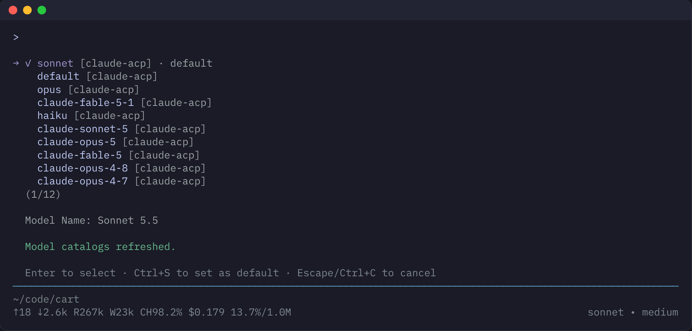
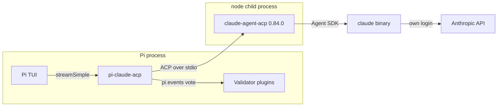
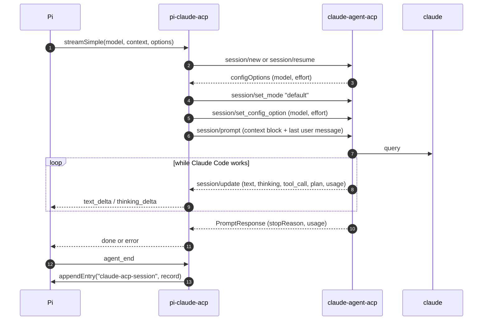
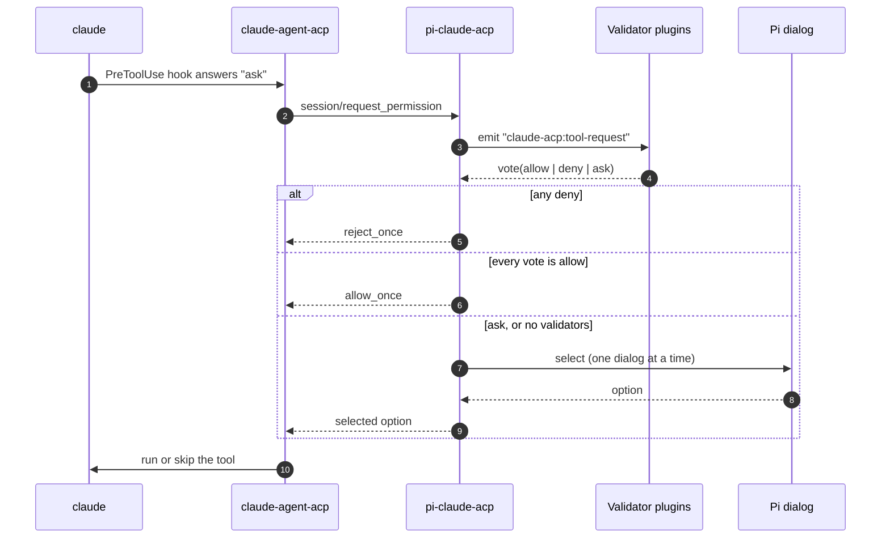
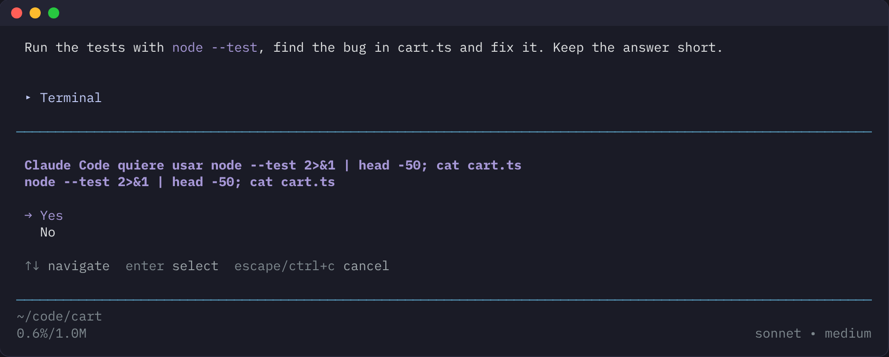
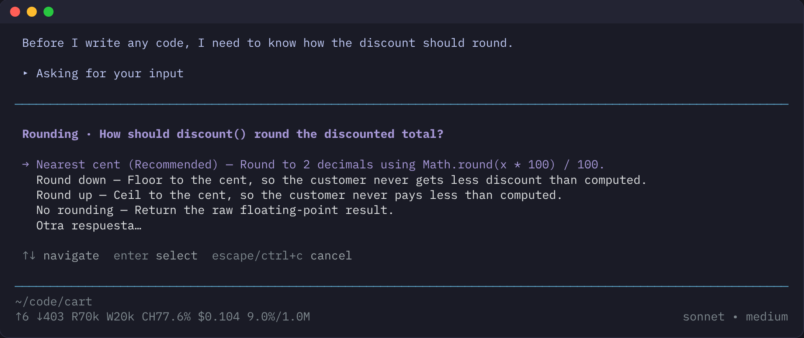
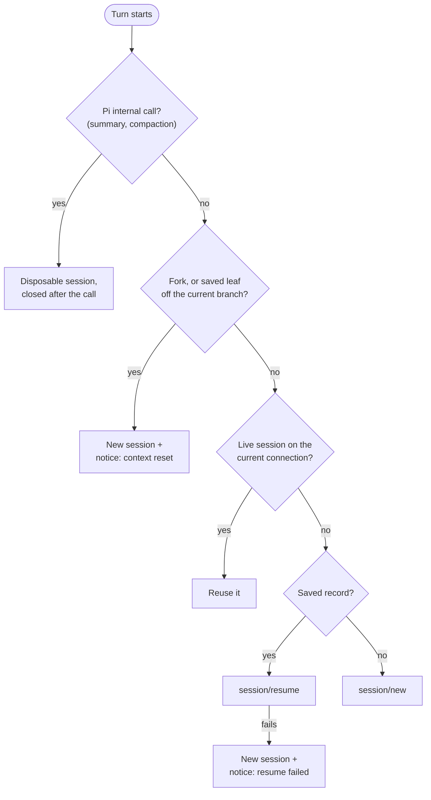
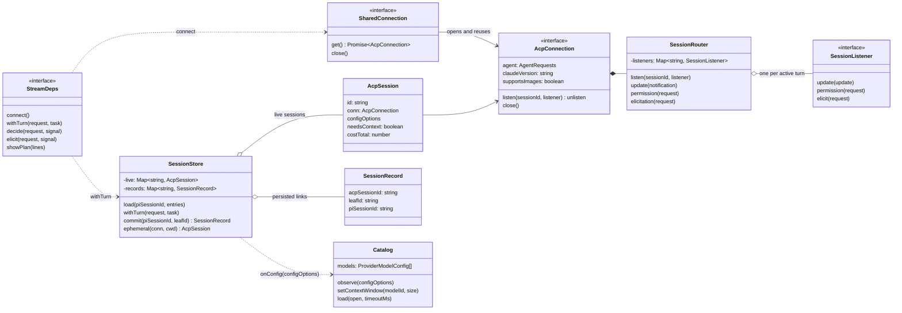

```text
 ⠀⠀⠀⠀⠀⠀⠀⠀⠀⠀⠀⠀⠀⠀⠀⠀⠀⠀⠀⠀⠀⠀⠀⠀⠀⠀⠀⠀⠀⠀⠀⠀⠀⠀⠀⠀⠀⠀⠀⠀⠀⠀⠀⠀⠀⠀⠀⠀⠀⠀⠀⠀⠀⠀⠀⠀⠀⠀⠀⠀⠀⠀⠀⠀⠀⠀⠀⠀⠀⠀⠀⣰⣦⣀⣴⣲⣾⡻⣦
 Claude Code inside Pi, over the Agent Client Protocol.⠀⠀⠀⠀⠀⠀⠀⠀⠀⠀⠀⠀⠀⠀⠀⠀⠀⣻⡂⡻⣿⡊⣻⡂⣺⡆
 ⠀⠀⠀⠀⠀⠀⠀⠀⠀⠀⠀⠀⠀⠀⠀⠀⠀⠀⠀⠀⠀⠀⠀⠀⠀⠀⠀⠀⠀⠀⠀⠀⠀⠀⠀⠀⠀⠀⠀⠀⠀⠀⠀⠀⠀⠀⠀⠀⠀⠀⠀⠀⠀⠀⠀⠀⠀⠀⠀⠀⠀⠀⠀⠀⠀⠀⠀⠀⠀⠀⠀⢸⡦⡂⣻⡇⡪⡂⣺⣧⣀
 pi install git:github.com/josemartinrodriguezmortaloni/pi-claude-acp⠀⠀⠀⢸⣯⡂⣺⡋⡢⡂⣪⡿⣺⡆
 ⠀⠀⠀⠀⠀⠀⠀⠀⠀⠀⠀⠀⠀⠀⠀⠀⠀⠀⠀⠀⠀⠀⠀⠀⠀⠀⠀⠀⠀⠀⠀⠀⠀⠀⠀⠀⠀⠀⠀⠀⠀⠀⠀⠀⠀⠀⠀⠀⠀⠀⠀⠀⠀⠀⠀⠀⠀⠀⠀⠀⠀⠀⠀⠀⠀⠀⠀⠀⠀⠀⠀⢸⡯⡪⡪⡢⡢⡊⣺⡪⣺⣧⡀
 ⚠ Status: 0.1.0. Pins claude-agent-acp 0.84.0 and Pi 0.99.1.⠀⠀⠀⠀⠀⠀⠀⠀⠀⠀⠀⣸⡧⡪⡂⡪⡂⠂⡪⡊⣺⡫⣷
 ⠀⠀⠀⠀⠀⠀⠀⠀⠀⠀⠀⠀⠀⠀⠀⠀⠀⠀⠀⠀⠀⠀⠀⠀⠀⠀⠀⠀⠀⠀⠀⠀⠀⠀⠀⠀⠀⠀⠀⠀⠀⠀⠀⠀⠀⠀⠀⠀⠀⠀⠀⠀⠀⠀⠀⠀⠀⠀⠀⠀⠀⠀⠀⠀⠀⠀⠀⠀⠀⠀⣠⡾⡢⡊⡢⡊⡀⡊⡢⡢⣪⡊⣾
 ⠀⠀⠀⠀⠀⠀⠀⠀⠀⠀⠀⠀⠀⠀⠀⠀⠀⠀⠀⠀⠀⠀⠀⠀⠀⠀⠀⠀⠀⠀⠀⠀⠀⠀⠀⠀⠀⠀⠀⠀⠀⠀⠀⠀⠀⠀⠀⠀⠀⠀⠀⠀⠀⠀⠀⠀⠀⠀⠀⠀⠀⠀⠀⠀⠀⠀⠀⠀⠀⢠⣾⡫⡂⡊⡀⠂⡂⠂⡂⡪⣪⣺⣿⡀
 ⠀⠀⠀⠀⠀⠀⠀⠀⠀⠀⠀⠀⠀⠀⠀⠀⠀⠀⠀⠀⠀⠀⠀⠀⠀⠀⠀⠀⠀⠀⠀⠀⠀⠀⠀⠀⠀⠀⠀⠀⠀⠀⠀⠀⠀⠀⠀⠀⠀⠀⠀⠀⠀⠀⠀⠀⠀⠀⠀⠀⠀⠀⠀⠀⠀⠀⠀⠀⢠⣾⣾⡂⡀⡂⡂⡂⡂⠂⡀⡢⡪⣫⣾⠃
 ⠀⠀⠀⠀⠀⠀⠀⠀⠀⠀⠀⠀⠀⠀⠀⠀⠀⠀⠀⠀⠀⠀⠀⠀⠀⠀⠀⠀⠀⠀⠀⠀⠀⠀⠀⠀⠀⠀⠀⠀⠀⠀⠀⠀⠀⠀⠀⠀⠀⠀⠀⠀⠀⠀⠀⠀⠀⠀⠀⠀⠀⠀⠀⠀⠀⠀⠀⢀⣾⣿⡪⡂⡀⡂⡀⠊⡂⡂⡀⠀⡺⣫⡿
 ⠀⠀⠀⠀⠀⠀⠀⠀⠀⠀⠀⠀⠀⠀⠀⠀⠀⠀⠀⠀⠀⠀⠀⠀⠀⠀⠀⠀⠀⠀⠀⠀⠀⠀⠀⠀⠀⠀⠀⠀⠀⠀⠀⠀⠀⠀⠀⠀⠀⠀⠀⠀⠀⠀⠀⠀⠀⠀⠀⠀⠀⠀⠀⠀⠀⠀⣠⣾⣿⡺⡂⠂⡀⡂⡂⡀⡀⡂⡀⡢⡾⡻⣧⠀⠀⠀⣀⣀
 ⠀⠀⠀⠀⠀⠀⠀⠀⠀⠀⠀⠀⠀⠀⠀⠀⠀⠀⠀⠀⠀⠀⠀⠀⠀⠀⠀⠀⠀⠀⠀⠀⠀⠀⠀⠀⠀⠀⠀⠀⠀⠀⠀⠀⠀⠀⠀⠀⠀⠀⠀⠀⠀⠀⠀⠀⠀⠀⠀⠀⠀⠀⠀⠀⠀⢰⣻⣿⣿⡺⡂⡀⡀⠂⡀⠂⡀⡀⡀⡊⣢⣾⡃⠀⢠⡾⡯⣺⡆
 ⠀⠀⠀⠀⢀⣠⣀⡀⠀⠀⠀⠀⠀⠀⠀⠀⠀⠀⠀⠀⠀⠀⠀⠀⠀⠀⠀⠀⠀⠀⠀⠀⠀⠀⠀⠀⠀⠀⠀⠀⠀⠀⠀⠀⠀⠀⠀⠀⠀⠀⠀⠀⠀⠀⠀⠀⠀⠀⡀⡀⡀⠀⠀⠀⠀⢸⣺⣿⣯⡂⡀⠂⡀⠀⡀⡂⡢⠂⡠⡪⣾⡞⠂⠀⢨⣿⣢⡾
 ⠀⠀⠀⠀⠸⣮⡊⡻⣶⣦⣤⣀⡀⠀⠀⠀⠀⠀⠀⠀⠀⠀⠀⠀⠀⠀⠀⠀⠀⠀⠀⠀⠀⠀⠀⠀⠀⠀⠀⠀⠀⠀⠀⠀⠀⠀⠀⠀⠀⠀⠀⠀⠀⠀⠀⣠⣾⣿⣿⡻⡿⡻⡲⣦⣀⢸⣾⣿⡮⡢⡂⡂⡀⡀⡀⡂⡀⡊⣢⣾⣾⣦⡀⢠⣾⡫⣪⡯
 ⠀⠀⠀⠀⠀⠈⠻⣦⣢⡪⣪⣻⣿⣿⣶⣦⣤⣠⣀⣀⣀⡀⡀⠀⠀⠀⠀⣀⣀⡀⡀⠀⠀⠀⠀⠀⠀⠀⠀⠀⠀⠀⠀⠀⠀⠀⠀⠀⠀⠀⠀⠀⠀⣠⣾⣿⣿⣿⡾⡛⡢⡺⣀⡊⡻⣻⣿⣿⣦⡪⡀⡂⡀⡂⡀⡂⡀⠊⣪⣪⣾⣾⣧⡾⣻⡚⠺⣧
 ⡶⡶⣦⣦⣤⣤⣤⣠⣨⣿⣶⣮⣺⣻⣿⣿⣾⣿⣾⣿⣿⣿⣿⣻⣾⣺⣾⡯⡫⡻⡻⡻⣾⣿⣾⣶⣾⣾⣶⣾⣲⣦⣦⣦⣀⡀⡀⠀⠀⠀⠀⠀⢠⣿⡪⣪⡾⡋⡪⡋⡂⡂⡀⡀⡀⡺⣦⣸⣾⣿⣢⡂⡀⠂⡀⡂⡀⠂⡪⣪⣪⣻⣿⡫⣾⡂⡀⣺⣦⣄⡀
 ⣦⣀⣀⡪⡪⡪⣪⣫⣪⣻⣪⣺⣪⣊⣪⣊⡊⡋⡛⡛⡻⠺⡺⡻⣪⡻⡪⡊⡂⠂⡀⡀⡀⡀⡊⠚⡚⠻⡿⡿⣿⣿⣿⣿⣾⣾⣷⣦⣀⡀⠀⠀⢸⣻⣪⡪⡢⡊⡾⠫⣢⣾⡢⠂⡀⡺⡻⡿⣿⡻⡺⣿⣶⣾⣦⣮⣦⣦⣦⣾⣾⣿⣿⣪⡊⡂⡈⣻⣿⣮⣻⡂
 ⠀⠈⠉⠛⠺⠺⠶⡾⡾⣾⣾⣻⣫⣻⣻⣻⣺⡺⣢⡺⡢⡢⡂⣠⣨⣪⣪⡊⡲⠺⡢⠂⣊⡊⡢⠂⣀⡂⡀⡀⡈⠊⡪⡪⣺⡻⣻⡺⡺⣻⡀⠀⠀⠛⠺⣾⣦⣮⣾⣾⡻⡿⡪⡂⡀⡊⡢⠂⡢⣪⡈⢺⣿⡫⡊⡺⡊⡋⡊⣪⣫⡪⣪⡺⣪⡪⣶⣾⣿⣿⡾⠃
 ⠀⠀⠀⠀⠀⠀⣠⣠⣤⣶⣻⣻⣿⣿⣿⣿⣿⣿⣿⣿⣿⣻⣿⣂⡢⣪⣪⣪⡂⡢⣢⡊⡋⡊⣠⣪⣪⡂⡀⡊⡀⠂⠂⠂⡈⡊⠊⡊⡀⡺⣷⣀⡀⣀⣀⣠⣤⣾⣿⣿⣾⣶⣮⡂⡀⠈⡂⡂⡀⡺⡂⣺⡪⡊⡀⠀⣠⡺⡺⣛⡪⡺⡺⡋⡢⡂⡪⡪⣾⣿
 ⠀⠀⠀⠀⠀⠺⣬⣨⣠⣊⣢⣪⣪⣺⣺⣻⣾⣻⣿⣿⣿⣾⣶⣾⣾⣺⣪⣊⡨⣢⣤⣢⡠⣈⣪⣫⣪⡂⡈⠺⣢⣢⡠⡂⡀⠀⡂⠂⣢⡚⣺⡻⡿⣿⣻⣿⣮⣻⡺⡛⡪⡻⣿⣿⣲⣮⣦⣚⡪⡺⡪⡻⡠⠂⠀⡂⡢⡂⡈⡛⣢⣺⡪⠂⣢⣾⣶⣮⣢⡻⣦
 ⠀⠀⠀⠀⠀⠀⠀⠈⠈⠈⠈⠈⣿⣛⣋⡛⣪⣻⣪⣻⣾⣺⣺⣻⣮⣿⣾⣺⣦⣪⣪⣪⣪⡊⡻⡻⡢⡺⣾⡢⡂⠈⡀⠂⣢⡊⡂⡢⡀⡊⡀⠂⣠⣾⣿⣻⣿⡻⣢⣺⣾⡾⡾⣾⣮⡻⡢⡪⡪⡂⡂⡀⡀⡂⡀⠀⡢⡂⣠⣂⣺⡾⡂⡚⡻⣿⡀⠈⠻⣿⣺⡆
 ⠀⠀⠀⠀⠀⠀⠀⠀⠀⠀⠀⠀⠈⠉⠋⠋⠋⢻⣿⡻⡻⡺⣫⣫⣺⣺⣾⣫⣾⣻⣫⣿⣾⣺⣦⡶⣢⣢⡢⠂⣶⣺⣢⡂⣠⣪⡊⡀⡀⡢⣂⡺⡪⡪⡪⡪⡪⠪⡊⠺⡻⣿⡶⣿⡿⣊⣢⣢⣦⡢⡀⠚⡢⡂⡀⡀⣀⣢⣾⣿⣿⡋⣢⣢⣢⡺⡻⣶⡾⣻⣾⠃
 ⠀⠀⠀⠀⠀⠀⠀⠀⠀⠀⠀⠀⠀⠀⠀⠀⠀⠈⠛⠛⠛⠛⠋⠉⣿⣫⣪⡾⠚⣻⣿⣫⣮⣪⣶⡾⡛⣫⣦⡚⡾⡻⡪⡊⣢⡢⡢⡺⡊⡋⡋⠈⣲⣦⣾⡮⡀⠀⠀⡢⣦⣶⣶⣾⣾⣿⣦⡊⣻⡂⡢⡂⡀⠀⡀⠀⡈⣻⣿⣿⣿⡂⣾⡿⣾⣪⣺⡾⠾⠚⠁
 ⠀⠀⠀⠀⠀⠀⠀⠀⠀⠀⠀⠀⠀⠀⠀⠀⠀⠀⠀⠀⠀⠀⠀⠀⠈⠈⠀⠀⢰⣻⣿⣻⡿⣿⣿⡫⡺⣻⣾⣾⡢⣢⡾⣺⣪⡢⣾⠊⣢⡪⡀⣺⣿⣿⡋⡂⡀⠀⠀⠊⡺⣻⣻⡾⣺⣿⣿⡊⡪⡂⡀⡂⡂⡂⡀⡀⡢⡪⣪⣿⡋⣺⣯⣠⣠⣈⣀⣠⡦⡦⣄⡀
 ⠀⠀⠀⠀⠀⠀⠀⠀⠀⠀⠀⠀⠀⠀⠀⠀⠀⠀⠀⠀⠀⠀⠀⠀⠀⠀⠀⠀⠀⠈⠀⠀⠀⢺⣪⣮⡾⠻⢺⡿⡂⣪⣮⣻⡪⣢⣢⣺⣢⣲⡾⡻⡫⠂⡀⡂⡀⠂⡀⠀⣠⣺⣾⡚⣻⡻⡂⡂⡀⠂⡀⡢⡊⠀⡀⣢⣀⡂⣺⡿⡀⡀⣨⣪⣮⣺⣻⣻⣢⡪⣪⣻
 ⠀⠀⠀⠀⠀⠀⠀⠀⠀⠀⠀⠀⠀⠀⠀⠀⠀⠀⠀⠀⠀⠀⠀⠀⠀⠀⣀⣠⣠⣀⡀⠀⠀⠀⠀⠀⠀⠀⣺⣣⣾⡾⣿⡿⣪⡾⣪⣾⣿⡋⣢⣾⡂⣢⡢⡂⡢⠊⣠⣾⣾⣿⣿⣊⣠⣶⡦⠂⣢⣢⡾⠊⡠⡠⣾⣏⣻⣿⣿⡂⣲⣾⣪⣺⣺⣻⣾⡾⠋⢻⣮⣺
 ⠀⠀⠀⠀⠀⠀⠀⠀⠀⠀⠀⠀⠀⠀⠀⠀⠀⠀⠀⠀⣀⣠⡶⡲⡶⣚⣫⣾⣶⣮⣿⣶⣤⣀⣀⡀⣀⣠⣾⣻⣷⣶⣿⣾⣿⣿⣿⣻⣪⡺⡻⣋⣢⣾⣶⣦⣦⣾⣾⣻⣻⡻⡺⡻⡻⡫⡦⡚⡊⣊⡠⡀⡀⡂⡈⣻⣿⡻⡪⣪⣿⣿⣿⡋⣠⣪⣻⣆⣠⣾⣫⡾
 ⠀⠀⠀⠀⠀⠀⠀⠀⠀⠀⠀⠀⠀⠀⠀⠀⠀⠀⠀⢠⣮⣾⡾⠾⠚⠋⢻⣿⡿⡿⣿⣻⡺⣿⣫⡻⣿⣿⣿⣾⣾⣾⣮⣻⣾⡻⡋⡊⣠⣢⣾⡾⡋⣋⣠⡾⡾⡺⣫⡫⣮⣫⣪⣊⡊⡊⡢⡚⡊⡊⡀⠀⡀⡀⣢⣺⣿⣪⡢⣾⣿⣻⡟⠻⣮⣻⣾⣯⡯⠞⠋
 ⠀⠀⠀⠀⠀⠀⠀⠀⠀⠀⠀⠀⠀⠀⠀⠀⠀⠀⣠⣾⣿⠋⠀⠀⠀⠀⠺⣻⡶⠚⠋⠛⠻⣮⣾⣺⣦⣊⣺⡻⣻⣺⣾⡛⡂⡢⣾⣾⣿⣻⡯⡺⡲⣺⣲⣶⣾⣿⣿⣿⣦⣢⣠⡂⡂⣊⣠⣶⣾⡾⣦⣢⡠⡢⣺⣿⡃⡺⣺⣿⣿⣺⡇
 ⠀⠀⠀⠀⠀⠀⠀⠀⠀⠀⠀⠀⠀⠀⠀⠀⠀⠀⣾⣺⡃⠀⠀⠀⠀⠀⣀⣠⣤⣦⣤⣀⡀⠀⣠⣿⡿⡻⡻⣺⣿⣫⣪⣢⣾⣿⣾⣿⣺⣿⣮⣢⣾⣾⣾⣾⣾⣾⣮⣪⣪⡢⡦⡚⣪⣫⣾⣾⣾⣢⡂⡊⡀⠊⡺⡛⡠⡊⣾⡻⣿⡾⠂
 ⠀⠀⠀⠀⠀⠀⠀⠀⠀⠀⠀⠀⠀⠀⠀⠀⠀⠀⠻⡾⡇⠀⠀⠀⣠⣾⣿⣻⣾⡿⡿⣿⡿⡻⣿⣻⣮⣶⣾⣻⣿⣺⣾⣿⣫⡺⡺⡻⣻⡻⣿⣿⣾⣿⣿⡿⡿⡻⡪⡊⡪⠂⣠⣺⣿⣿⣿⣿⡿⡿⣪⡂⡢⡂⡢⠂⡢⠊⣪⣪⡟
 ⠀⠀⠀⠀⠀⠀⠀⠀⠀⠀⠀⠀⠀⠀⠀⠀⠀⠀⠀⠀⠀⠀⣠⡞⡋⡀⣠⣢⡀⠂⡀⡂⡀⡂⡪⡻⣿⣻⣾⡺⣺⡻⡾⡻⡪⡊⡊⡊⣠⣾⣾⣿⣮⡊⡊⠻⣢⡢⣢⡢⡀⣲⣿⣻⡺⡻⡿⡻⣂⡂⡂⡊⣢⣦⡆⣢⣢⣶⠞⠋
 ⠀⠀⠀⠀⠀⠀⠀⠀⠀⠀⠀⠀⠀⠀⠀⠀⠀⠀⠀⠀⠀⠀⣿⠂⡀⡊⣺⣿⣶⣶⣦⣮⣮⡶⡶⣶⣦⡀⡀⡂⡀⡂⡢⡢⡢⠂⠀⣾⣿⣿⣿⡻⡂⠂⠀⠀⡀⠚⠺⠺⡚⠋⡊⡪⡠⡂⡀⡺⡛⠂⡂⠢⣺⣿⣢⣺⡾⠃
 ⠀⠀⠀⠀⠀⠀⠀⠀⠀⠀⠀⠀⠀⠀⠀⠀⠀⠀⠀⠀⠀⠀⠻⣦⣢⣢⣢⡪⣻⡻⡻⣿⣄⡀⡀⠀⣸⣿⣾⣾⣾⣾⡢⡂⡀⣠⣾⣿⡿⠋⡊⡀⡀⡂⠀⠂⡀⠂⡀⠀⡠⡢⡀⡂⡀⠀⡀⠂⠀⠂⠀⣠⣾⣿⣾⣺⡃
 ⠀⠀⠀⠀⠀⠀⠀⠀⠀⠀⠀⠀⠀⠀⠀⠀⠀⠀⠀⠀⠀⠀⠀⠀⠈⣹⣿⣿⣿⣿⣾⣪⣺⡻⣿⣿⣿⣿⣻⡻⣿⣾⣦⡪⣺⣻⡾⠋⡀⠂⡀⠂⡀⡢⡂⠂⠀⠂⡢⠂⡀⡪⡢⠂⡠⠊⡂⡀⡠⠂⣺⡟⣻⣿⣪⡟
 ⠀⠀⠀⠀⠀⠀⠀⠀⠀⠀⠀⠀⠀⠀⠀⠀⠀⠀⠀⠀⠀⠀⠀⠀⣸⣿⡿⡋⡋⡊⣢⡊⡊⡒⠪⠻⣿⣿⣺⣿⣾⡾⣺⣺⣿⡫⡂⠂⡀⠂⡀⡂⡀⠀⠠⡂⡢⡂⣠⡢⡪⠂⠀⠀⣠⡂⡀⡂⡀⡂⣺⣦⣾⡫⣾⠂
 ⠀⠀⠀⠀⠀⠀⠀⠀⠀⠀⠀⠀⠀⠀⠀⠀⠀⠀⠀⠀⠀⠀⠀⣾⣯⣢⣢⣪⣪⡺⡺⣺⣪⣾⡆⠀⡀⡀⡈⡈⣠⣾⣾⡿⡋⠂⡀⠂⡀⠀⡀⡀⡢⡂⡀⠀⣢⡊⠀⠀⡀⠀⣀⣺⡋⡂⡀⡢⡢⣢⣾⣿⡿⣺⡏
 ⠀⠀⠀⠀⠀⠀⠀⠀⠀⠀⠀⠀⠀⠀⠀⠀⠀⠀⠀⠀⠀⠀⠀⣿⣾⣾⣾⣿⣮⣺⣾⣿⣯⡘⣯⣪⣢⡢⡂⣺⣿⣿⡫⡂⡠⡂⡠⡢⡢⠊⡢⠪⡂⠂⡢⣪⡪⡂⣠⣢⣢⣢⣾⣫⣢⣺⣦⡾⠾⠋⠀⣿⣢⡾
 ⠀⠀⠀⠀⠀⠀⠀⠀⠀⠀⠀⠀⠀⠀⠀⠀⠀⠀⠀⠀⠀⠀⠀⣿⣿⣿⡫⣻⡾⢿⣿⣯⣿⣻⠀⠈⣿⡂⣸⣿⡿⡋⡠⡪⡂⡂⣺⣻⣦⣢⣢⣢⣦⡂⣺⣻⣪⡪⣿⠋⣿⣿⣿⡟⠉⠀⠀⠀⠀⠀⣸⡿⣾⠃
 ⠀⠀⠀⠀⠀⠀⠀⠀⠀⠀⠀⠀⠀⠀⠀⠀⠀⠀⠀⠀⠀⣀⣾⣿⣮⣻⣢⣺⣧⡈⠻⠻⡚⣋⣠⣾⣫⣪⣾⡫⡂⠂⡠⠂⣢⣺⣺⡻⡪⡚⣿⡀⣺⣫⣿⣿⣮⣾⣿⣿⣿⡿⠋⠀⠀⠀⠀⠀⠀⠀⣺⣺⠃
 ⠀⠀⠀⠀⠀⠀⠀⠀⠀⠀⠀⠀⠀⠀⠀⠀⠀⠀⠀⠀⣰⣻⡎⠈⠙⠻⣿⣿⣾⣿⣾⡾⣻⣻⣫⣫⣪⣾⡯⡂⡀⡂⣢⡺⣺⣿⣿⣾⡂⠂⡈⣻⡿⣺⣿⣾⡿⠻⣫⡾⠋
 ⠀⠀⠀⠀⠀⠀⠀⠀⠀⠀⠀⠀⠀⠀⠀⠀⠀⠀⠀⣰⣿⠋⠀⠀⠀⠀⠀⠈⠈⠻⣿⣾⣾⣿⣿⣿⣾⡿⡂⠂⡀⣺⡾⠛⣻⣻⡿⢿⣾⣶⣦⡊⣨⣊⣠⣠⣦⡾⠋
 ⠀⠀⠀⠀⠀⠀⠀⠀⠀⠀⠀⠀⠀⠀⠀⠀⠀⠀⠀⣺⡏⠀⠀⠀⠀⠀⠀⠀⠀⠀⡈⠋⠈⠈⣺⣻⣿⡂⣠⡀⡸⣿⣦⣀⡈⠉⣀⣾⣿⡿⣫⡾⠋⠉⠈⠈
 ⠀⠀⠀⠀⠀⠀⠀⠀⠀⠀⠀⠀⠀⠀⠀⠀⠀⠀⠀⠈⠀⠀⠀⠀⠀⠀⠀⠀⣠⡾⠂⠀⢀⣾⣺⣾⡊⣺⡿⠲⣦⣺⣪⡻⣻⣻⣻⣻⡿⠚⠋
 ⠀⠀⠀⠀⠀⠀⠀⠀⠀⠀⠀⠀⠀⠀⠀⠀⠀⠀⠀⠀⠀⠀⠀⠀⠀⠀⠀⠀⠊⠀⠀⣠⣾⣿⣿⡋⣰⡏⠀⠀⠀⠈⠉⠛⠋⠋⠉
 ⠀⠀⠀⠀⠀⠀⠀⠀⠀⠀⠀⠀⠀⠀⠀⠀⠀⠀⠀⠀⠀⠀⠀⠀⠀⠀⠀⠀⠀⠀⣸⣻⣿⣿⣯⣺⡏
 ⠀⠀⠀⠀⠀⠀⠀⠀⠀⠀⠀⠀⠀⠀⠀⠀⠀⠀⠀⠀⠀⠀⠀⠀⠀⠀⠀⠀⠀⠀⠺⣮⣪⡾⣪⡾⠂
 ⠀⠀⠀⠀⠀⠀⠀⠀⠀⠀⠀⠀⠀⠀⠀⠀⠀⠀⠀⠀⠀⠀⠀⠀⠀⠀⠀⠀⠀⠀⠀⠈⠀⠈⠉
```

pi-claude-acp is a [Pi](https://github.com/earendil-works/pi) extension that registers Claude Code as the Pi provider `claude-acp`. It launches [`claude-agent-acp`](https://github.com/agentclientprotocol/claude-agent-acp), the ACP adapter that Zed uses, which runs your installed `claude` binary with its own login. Pi owns the conversation, the permissions, the skills and the context. Claude Code receives the prompt, does the work with its native tools and streams the result back to Pi.

## Highlights

- **Your binary, your login:** only the `claude` binary talks to Anthropic; the extension never reads, stores or logs tokens
- **Pi approves every tool call:** a `PreToolUse` hook sends each Claude Code tool call to Pi validator plugins and the Pi dialog; the extension never approves on its own
- **Live catalog:** models and effort levels come from the adapter at runtime; Pi thinking levels map to the closest effort
- **Sessions that resume:** the ACP session id lives in the Pi session, so `--continue`, forks and tree navigation keep or reset Claude Code's history on purpose
- **Questions through Pi:** `AskUserQuestion` opens Pi dialogs, and Claude Code's plan shows as a live widget above the editor

<p>
  <a href="https://github.com/earendil-works/pi"></a>
  <a href="https://docs.anthropic.com/en/docs/claude-code"></a>
  <a href="https://agentclientprotocol.com"></a>
  <a href="https://www.typescriptlang.org"></a>
  <a href="https://github.com/josemartinrodriguezmortaloni/pi-claude-acp/commits/main"></a>
</p>

## Install

You need:

- **Pi 0.99.1** (`pi --version`).
- **Node 22 or later** on the `PATH`: the extension starts the adapter with `node`.
- **Claude Code** on the `PATH`. If it has no login, run `/claude-login` in Pi.

```bash
pi install git:github.com/josemartinrodriguezmortaloni/pi-claude-acp
```

Pi clones the repo and runs `npm install`, which installs the pinned adapter. To install from a clone:

```bash
git clone https://github.com/josemartinrodriguezmortaloni/pi-claude-acp.git
cd pi-claude-acp
bun install
pi install "$PWD"
```

## Get started

Pick a Claude Code model with `/model`, or start Pi on one:

```bash
pi --provider claude-acp --model sonnet
pi --provider claude-acp --model opus --thinking high
```

To make it the default, set `"defaultProvider": "claude-acp"` and `"defaultModel": "sonnet"` in `~/.pi/agent/settings.json`.

### Log in

When a `claude-acp` model is active and Claude Code has no login, Pi shows a warning at session start. Run:

```text
/claude-login
```

Pi hands its terminal to `claude auth login`, which opens the browser login. When the login ends, Pi comes back and restarts the adapter, so the next turn uses the new account. The extension never reads or stores the credentials: the `claude` binary keeps them. Outside the Pi TUI, run `claude auth login` in a terminal.



## Configuration

The extension has no settings file. It reads these sources:

| Source                                           | Use                                                                                                          |
| ------------------------------------------------ | ------------------------------------------------------------------------------------------------------------ |
| `CLAUDE_CODE_EXECUTABLE`                         | Path to the `claude` binary. Without it, the extension looks up `claude` on the `PATH`                        |
| `~/.pi/agent/mcp.json`                           | MCP servers passed to each Claude Code session; servers with `"enabled": false` are skipped                   |
| `~/.pi/agent/AGENTS.md`, `./AGENTS.md`, Pi skills | Sent as a `<pi-context>` block before the first prompt of each Claude Code session                            |
| `~/.pi/agent/claude-acp/adapter.log`             | Output, not input: adapter stderr, and every permission request with its answer                              |

The extension checks the binary before it starts the adapter: the first line of `claude --version` must be `<x.y.z> (Claude Code)`. A wrapper that prints anything else fails with the tested path and its output. For example, the mise shim prints install progress, so point the variable at the real binary:

```bash
export CLAUDE_CODE_EXECUTABLE=~/.local/share/mise/installs/claude/latest/claude
```

Claude Code loads nothing from `~/.claude`: every session starts with `settingSources: []` and without Claude Code plugins. Configure guardrails, skills and MCP servers in Pi.

## How it works

One adapter process serves every Pi session of a Pi process. The extension talks to it with JSON-RPC over stdio. Each Pi session maps to one ACP session.



### A prompt turn

Pi calls the provider's `streamSimple` with the whole transcript. The extension sends only the last user message: Claude Code keeps the rest of the history in its own session.



The extension forces the `default` mode after it creates or resumes a session. The adapter reads `defaultMode` from `~/.claude` even with `settingSources: []`, and a permissive mode could skip the `ask` hook.

The context block (steps 6 and later) goes only with the first prompt of each ACP session. It goes again after a new session, a reset, or a compaction inside Claude Code.

### Permissions

Every session starts with an inline `PreToolUse` hook that answers `ask`. So Claude Code sends every tool call to `session/request_permission`, and the extension turns it into a vote.





| Case                                    | Answer                                                                 |
| --------------------------------------- | ---------------------------------------------------------------------- |
| A validator votes `deny`, or its vote rejects | Reject                                                           |
| All validators vote `allow`             | Approve                                                                |
| A validator votes `ask`, or none votes  | Pi dialog. Without a Pi UI, reject                                     |
| The turn is cancelled                   | `cancelled`                                                            |

The dialog hides the "always allow" options: with the `ask` hook, Claude Code ignores the rule they write. Pi keeps one dialog at a time, so parallel tool calls wait in a queue instead of replacing each other.

A validator is a Pi extension that listens on `pi.events` and calls `vote` synchronously in its handler:

```ts
import type { ExtensionAPI } from "@earendil-works/pi-coding-agent";

type Vote = "allow" | "deny" | "ask";
interface ToolRequest {
  toolCall: { title?: string; rawInput?: unknown };
  vote(decision: Promise<Vote>): void;
}

export default function (pi: ExtensionAPI) {
  pi.events.on("claude-acp:tool-request", (data) => {
    const request = data as ToolRequest;
    const { command } = Object(request.toolCall.rawInput) as { command?: string };
    request.vote(Promise.resolve(command?.startsWith("rm -rf") ? "deny" : "ask"));
  });
}
```

### Questions and plan

The extension announces the ACP `elicitation.form` capability. When Claude Code calls `AskUserQuestion`, each question opens a Pi `select`. "Otra respuesta…" opens a text field, and a multi-select question toggles options until "Listo". Escape declines the form, which Claude Code reads as "the user skipped".



When Claude Code sends a plan, it shows as a widget above the editor: `✓` done, `›` in progress, `·` pending. The widget closes when every entry is done.

### Transcript

Claude Code's tool calls are Markdown text in the Pi message, not Pi tool calls: Pi did not run them.

| ACP update                              | In Pi                                                                  |
| --------------------------------------- | ---------------------------------------------------------------------- |
| `agent_message_chunk`                   | Text                                                                   |
| `agent_thought_chunk`                   | Thinking                                                               |
| `tool_call`                             | `▸ <title>`                                                            |
| `tool_call_update`, final status        | `✓ completed` or `✗ failed`, then the first 5 lines or 400 characters of the result |
| `plan`                                  | Widget above the editor                                                |
| `usage_update`                          | Turn cost and the model's context window                               |
| `compaction_update`                     | The next prompt carries the context block again                        |

### Sessions

`SessionStore` maps each Pi session to an ACP session. After each turn, Pi saves a `claude-acp-session` entry with `{acpSessionId, leafId, piSessionId}`.



- Turns of one Pi session run one after another.
- Pi's own compaction is cancelled for `claude-acp` models: Claude Code compacts its own history.

### Models

The catalog comes from the `model` and `effort` config options of the adapter. The extension reads them from a disposable session at startup, with a 15 s timeout, and learns more from every config response. The adapter reports effort levels only for the current model of a session, so a model not used yet shows the levels of the first model seen.

| Pi thinking level | Effort sent                                                            |
| ----------------- | ---------------------------------------------------------------------- |
| `off`, `minimal`  | The lowest level the model offers                                      |
| Any other         | The closest offered level at or below it                               |

The context window starts at 128000 tokens and changes to the value Claude Code reports after the first turn. The turn cost is the delta of Claude Code's cumulative cost.

## Architecture

Each module owns one reason to change. `index.ts` only registers the provider and wires the Pi events.

| Module           | Owns                                                                  | Changes when                         |
| ---------------- | --------------------------------------------------------------------- | ------------------------------------ |
| `connection.ts`  | Binary check, adapter process, ACP handshake, routing by session      | The ACP SDK changes                  |
| `sessions.ts`    | Pi session ↔ ACP session, session options, context block, MCP servers | Pi session semantics change          |
| `catalog.ts`     | `configOptions` → Pi models and thinking levels                       | The adapter's model format changes   |
| `stream.ts`      | `session/update` → Pi message events                                  | The Pi or ACP stream contract changes |
| `permissions.ts` | `request_permission` → validator votes and the Pi dialog              | The validation contract changes      |
| `elicitation.ts` | ACP form elicitation → Pi dialogs                                     | The elicitation contract changes     |
| `dialogs.ts`     | One Pi dialog at a time                                               | Pi's dialog model changes            |
| `login.ts`       | Login check at session start and `/claude-login`                      | Claude Code's auth CLI changes       |



## Limits

- Claude Code receives only the last user message. Editing an earlier message in Pi, or moving in the tree, starts a new Claude Code session without the old history.
- Pi's system prompt is not sent. Claude Code keeps its own; Pi context arrives as the `<pi-context>` block.
- Pi does not run Claude Code's tools, so Pi tool hooks and renderers do not see them. Validators see them through `claude-acp:tool-request`.
- The adapter version is pinned. A new adapter needs a new release of this extension.

## Development

```bash
bun install          # also points git at .githooks/
pi -e ./src/index.ts # load the working tree in Pi
```

Gate every change before a commit:

| Command              | Checks                                                                   |
| -------------------- | ------------------------------------------------------------------------ |
| `bun run typecheck`  | `tsc --noEmit`, strict                                                   |
| `bun run lint`       | Biome                                                                    |
| `bun run complexity` | ESLint, cyclomatic complexity < 4 per function                           |
| `bun run test`       | vitest against an in-memory ACP connection and a fake adapter            |
| `bun run smoke`      | Real Claude Code: lists models, sends a prompt, checks the permission hook. Uses quota |

`pre-commit` runs typecheck, lint and complexity. `pre-push` runs typecheck and tests. The smoke test never runs in a hook.

[`specs/pi-claude-acp.md`](specs/pi-claude-acp.md) holds the design, its invariants and the edge cases. Each edge case has a test with `C<n>` in its name.

## Credits

Built on [Pi](https://github.com/earendil-works/pi) by Earendil and the [Agent Client Protocol](https://agentclientprotocol.com). The adapter is [`@agentclientprotocol/claude-agent-acp`](https://www.npmjs.com/package/@agentclientprotocol/claude-agent-acp).
