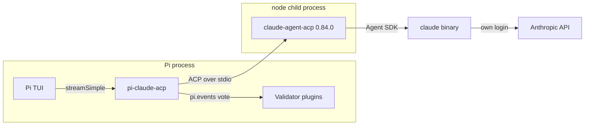
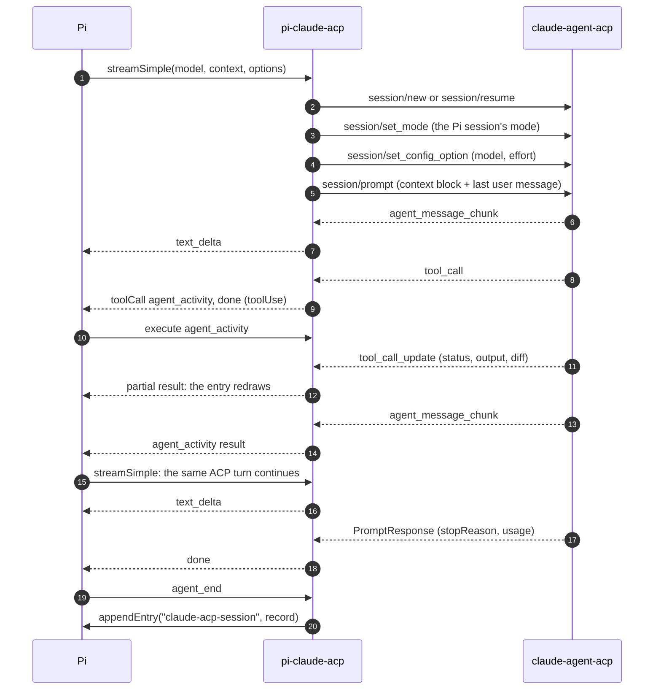
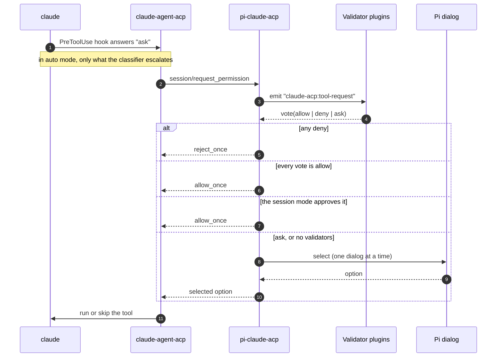
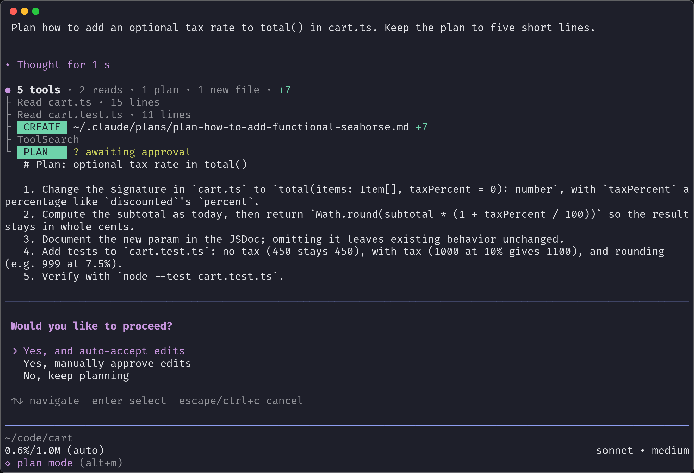
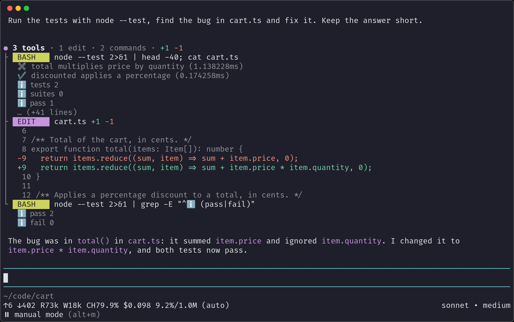
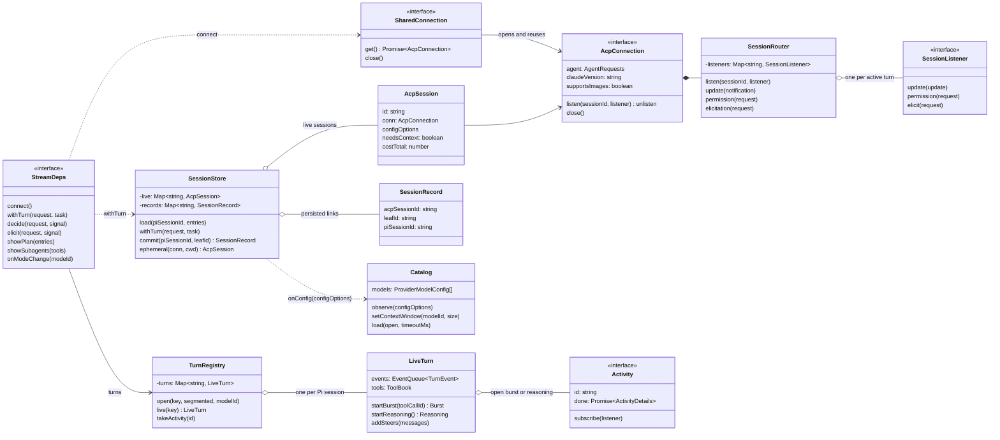

```text
 ⠀⠀⠀⠀⠀⠀⠀⠀⠀⠀⠀⠀⠀⠀⠀⠀⠀⠀⠀⠀⠀⠀⠀⠀⠀⠀⠀⠀⠀⠀⠀⠀⠀⠀⠀⠀⠀⠀⠀⠀⠀⠀⠀⠀⠀⠀⠀⠀⠀⠀⠀⠀⠀⠀⠀⠀⠀⠀⠀⠀⠀⠀⠀⠀⠀⠀⠀⠀⠀⠀⠀⣰⣦⣀⣴⣲⣾⡻⣦
 Claude Code inside Pi, over the Agent Client Protocol.⠀⠀⠀⠀⠀⠀⠀⠀⠀⠀⠀⠀⠀⠀⠀⠀⠀⣻⡂⡻⣿⡊⣻⡂⣺⡆
 ⠀⠀⠀⠀⠀⠀⠀⠀⠀⠀⠀⠀⠀⠀⠀⠀⠀⠀⠀⠀⠀⠀⠀⠀⠀⠀⠀⠀⠀⠀⠀⠀⠀⠀⠀⠀⠀⠀⠀⠀⠀⠀⠀⠀⠀⠀⠀⠀⠀⠀⠀⠀⠀⠀⠀⠀⠀⠀⠀⠀⠀⠀⠀⠀⠀⠀⠀⠀⠀⠀⠀⢸⡦⡂⣻⡇⡪⡂⣺⣧⣀
 pi install git:github.com/josemartinrodriguezmortaloni/pi-claude-acp⠀⠀⠀⢸⣯⡂⣺⡋⡢⡂⣪⡿⣺⡆
 ⠀⠀⠀⠀⠀⠀⠀⠀⠀⠀⠀⠀⠀⠀⠀⠀⠀⠀⠀⠀⠀⠀⠀⠀⠀⠀⠀⠀⠀⠀⠀⠀⠀⠀⠀⠀⠀⠀⠀⠀⠀⠀⠀⠀⠀⠀⠀⠀⠀⠀⠀⠀⠀⠀⠀⠀⠀⠀⠀⠀⠀⠀⠀⠀⠀⠀⠀⠀⠀⠀⠀⢸⡯⡪⡪⡢⡢⡊⣺⡪⣺⣧⡀
 ⚠ Status: 0.1.0. Pins claude-agent-acp 0.84.0 and Pi 0.99.1.⠀⠀⠀⠀⠀⠀⠀⠀⠀⠀⠀⣸⡧⡪⡂⡪⡂⠂⡪⡊⣺⡫⣷
 ⠀⠀⠀⠀⠀⠀⠀⠀⠀⠀⠀⠀⠀⠀⠀⠀⠀⠀⠀⠀⠀⠀⠀⠀⠀⠀⠀⠀⠀⠀⠀⠀⠀⠀⠀⠀⠀⠀⠀⠀⠀⠀⠀⠀⠀⠀⠀⠀⠀⠀⠀⠀⠀⠀⠀⠀⠀⠀⠀⠀⠀⠀⠀⠀⠀⠀⠀⠀⠀⠀⣠⡾⡢⡊⡢⡊⡀⡊⡢⡢⣪⡊⣾
 ⠀⠀⠀⠀⠀⠀⠀⠀⠀⠀⠀⠀⠀⠀⠀⠀⠀⠀⠀⠀⠀⠀⠀⠀⠀⠀⠀⠀⠀⠀⠀⠀⠀⠀⠀⠀⠀⠀⠀⠀⠀⠀⠀⠀⠀⠀⠀⠀⠀⠀⠀⠀⠀⠀⠀⠀⠀⠀⠀⠀⠀⠀⠀⠀⠀⠀⠀⠀⠀⢠⣾⡫⡂⡊⡀⠂⡂⠂⡂⡪⣪⣺⣿⡀
 ⠀⠀⠀⠀⠀⠀⠀⠀⠀⠀⠀⠀⠀⠀⠀⠀⠀⠀⠀⠀⠀⠀⠀⠀⠀⠀⠀⠀⠀⠀⠀⠀⠀⠀⠀⠀⠀⠀⠀⠀⠀⠀⠀⠀⠀⠀⠀⠀⠀⠀⠀⠀⠀⠀⠀⠀⠀⠀⠀⠀⠀⠀⠀⠀⠀⠀⠀⠀⢠⣾⣾⡂⡀⡂⡂⡂⡂⠂⡀⡢⡪⣫⣾⠃
 ⠀⠀⠀⠀⠀⠀⠀⠀⠀⠀⠀⠀⠀⠀⠀⠀⠀⠀⠀⠀⠀⠀⠀⠀⠀⠀⠀⠀⠀⠀⠀⠀⠀⠀⠀⠀⠀⠀⠀⠀⠀⠀⠀⠀⠀⠀⠀⠀⠀⠀⠀⠀⠀⠀⠀⠀⠀⠀⠀⠀⠀⠀⠀⠀⠀⠀⠀⢀⣾⣿⡪⡂⡀⡂⡀⠊⡂⡂⡀⠀⡺⣫⡿
 ⠀⠀⠀⠀⠀⠀⠀⠀⠀⠀⠀⠀⠀⠀⠀⠀⠀⠀⠀⠀⠀⠀⠀⠀⠀⠀⠀⠀⠀⠀⠀⠀⠀⠀⠀⠀⠀⠀⠀⠀⠀⠀⠀⠀⠀⠀⠀⠀⠀⠀⠀⠀⠀⠀⠀⠀⠀⠀⠀⠀⠀⠀⠀⠀⠀⠀⣠⣾⣿⡺⡂⠂⡀⡂⡂⡀⡀⡂⡀⡢⡾⡻⣧⠀⠀⠀⣀⣀
 ⠀⠀⠀⠀⠀⠀⠀⠀⠀⠀⠀⠀⠀⠀⠀⠀⠀⠀⠀⠀⠀⠀⠀⠀⠀⠀⠀⠀⠀⠀⠀⠀⠀⠀⠀⠀⠀⠀⠀⠀⠀⠀⠀⠀⠀⠀⠀⠀⠀⠀⠀⠀⠀⠀⠀⠀⠀⠀⠀⠀⠀⠀⠀⠀⠀⢰⣻⣿⣿⡺⡂⡀⡀⠂⡀⠂⡀⡀⡀⡊⣢⣾⡃⠀⢠⡾⡯⣺⡆
 ⠀⠀⠀⠀⢀⣠⣀⡀⠀⠀⠀⠀⠀⠀⠀⠀⠀⠀⠀⠀⠀⠀⠀⠀⠀⠀⠀⠀⠀⠀⠀⠀⠀⠀⠀⠀⠀⠀⠀⠀⠀⠀⠀⠀⠀⠀⠀⠀⠀⠀⠀⠀⠀⠀⠀⠀⠀⠀⡀⡀⡀⠀⠀⠀⠀⢸⣺⣿⣯⡂⡀⠂⡀⠀⡀⡂⡢⠂⡠⡪⣾⡞⠂⠀⢨⣿⣢⡾
 ⠀⠀⠀⠀⠸⣮⡊⡻⣶⣦⣤⣀⡀⠀⠀⠀⠀⠀⠀⠀⠀⠀⠀⠀⠀⠀⠀⠀⠀⠀⠀⠀⠀⠀⠀⠀⠀⠀⠀⠀⠀⠀⠀⠀⠀⠀⠀⠀⠀⠀⠀⠀⠀⠀⠀⣠⣾⣿⣿⡻⡿⡻⡲⣦⣀⢸⣾⣿⡮⡢⡂⡂⡀⡀⡀⡂⡀⡊⣢⣾⣾⣦⡀⢠⣾⡫⣪⡯
 ⠀⠀⠀⠀⠀⠈⠻⣦⣢⡪⣪⣻⣿⣿⣶⣦⣤⣠⣀⣀⣀⡀⡀⠀⠀⠀⠀⣀⣀⡀⡀⠀⠀⠀⠀⠀⠀⠀⠀⠀⠀⠀⠀⠀⠀⠀⠀⠀⠀⠀⠀⠀⠀⣠⣾⣿⣿⣿⡾⡛⡢⡺⣀⡊⡻⣻⣿⣿⣦⡪⡀⡂⡀⡂⡀⡂⡀⠊⣪⣪⣾⣾⣧⡾⣻⡚⠺⣧
 ⡶⡶⣦⣦⣤⣤⣤⣠⣨⣿⣶⣮⣺⣻⣿⣿⣾⣿⣾⣿⣿⣿⣿⣻⣾⣺⣾⡯⡫⡻⡻⡻⣾⣿⣾⣶⣾⣾⣶⣾⣲⣦⣦⣦⣀⡀⡀⠀⠀⠀⠀⠀⢠⣿⡪⣪⡾⡋⡪⡋⡂⡂⡀⡀⡀⡺⣦⣸⣾⣿⣢⡂⡀⠂⡀⡂⡀⠂⡪⣪⣪⣻⣿⡫⣾⡂⡀⣺⣦⣄⡀
 ⣦⣀⣀⡪⡪⡪⣪⣫⣪⣻⣪⣺⣪⣊⣪⣊⡊⡋⡛⡛⡻⠺⡺⡻⣪⡻⡪⡊⡂⠂⡀⡀⡀⡀⡊⠚⡚⠻⡿⡿⣿⣿⣿⣿⣾⣾⣷⣦⣀⡀⠀⠀⢸⣻⣪⡪⡢⡊⡾⠫⣢⣾⡢⠂⡀⡺⡻⡿⣿⡻⡺⣿⣶⣾⣦⣮⣦⣦⣦⣾⣾⣿⣿⣪⡊⡂⡈⣻⣿⣮⣻⡂
 ⠀⠈⠉⠛⠺⠺⠶⡾⡾⣾⣾⣻⣫⣻⣻⣻⣺⡺⣢⡺⡢⡢⡂⣠⣨⣪⣪⡊⡲⠺⡢⠂⣊⡊⡢⠂⣀⡂⡀⡀⡈⠊⡪⡪⣺⡻⣻⡺⡺⣻⡀⠀⠀⠛⠺⣾⣦⣮⣾⣾⡻⡿⡪⡂⡀⡊⡢⠂⡢⣪⡈⢺⣿⡫⡊⡺⡊⡋⡊⣪⣫⡪⣪⡺⣪⡪⣶⣾⣿⣿⡾⠃
 ⠀⠀⠀⠀⠀⠀⣠⣠⣤⣶⣻⣻⣿⣿⣿⣿⣿⣿⣿⣿⣿⣻⣿⣂⡢⣪⣪⣪⡂⡢⣢⡊⡋⡊⣠⣪⣪⡂⡀⡊⡀⠂⠂⠂⡈⡊⠊⡊⡀⡺⣷⣀⡀⣀⣀⣠⣤⣾⣿⣿⣾⣶⣮⡂⡀⠈⡂⡂⡀⡺⡂⣺⡪⡊⡀⠀⣠⡺⡺⣛⡪⡺⡺⡋⡢⡂⡪⡪⣾⣿
 ⠀⠀⠀⠀⠀⠺⣬⣨⣠⣊⣢⣪⣪⣺⣺⣻⣾⣻⣿⣿⣿⣾⣶⣾⣾⣺⣪⣊⡨⣢⣤⣢⡠⣈⣪⣫⣪⡂⡈⠺⣢⣢⡠⡂⡀⠀⡂⠂⣢⡚⣺⡻⡿⣿⣻⣿⣮⣻⡺⡛⡪⡻⣿⣿⣲⣮⣦⣚⡪⡺⡪⡻⡠⠂⠀⡂⡢⡂⡈⡛⣢⣺⡪⠂⣢⣾⣶⣮⣢⡻⣦
 ⠀⠀⠀⠀⠀⠀⠀⠈⠈⠈⠈⠈⣿⣛⣋⡛⣪⣻⣪⣻⣾⣺⣺⣻⣮⣿⣾⣺⣦⣪⣪⣪⣪⡊⡻⡻⡢⡺⣾⡢⡂⠈⡀⠂⣢⡊⡂⡢⡀⡊⡀⠂⣠⣾⣿⣻⣿⡻⣢⣺⣾⡾⡾⣾⣮⡻⡢⡪⡪⡂⡂⡀⡀⡂⡀⠀⡢⡂⣠⣂⣺⡾⡂⡚⡻⣿⡀⠈⠻⣿⣺⡆
 ⠀⠀⠀⠀⠀⠀⠀⠀⠀⠀⠀⠀⠈⠉⠋⠋⠋⢻⣿⡻⡻⡺⣫⣫⣺⣺⣾⣫⣾⣻⣫⣿⣾⣺⣦⡶⣢⣢⡢⠂⣶⣺⣢⡂⣠⣪⡊⡀⡀⡢⣂⡺⡪⡪⡪⡪⡪⠪⡊⠺⡻⣿⡶⣿⡿⣊⣢⣢⣦⡢⡀⠚⡢⡂⡀⡀⣀⣢⣾⣿⣿⡋⣢⣢⣢⡺⡻⣶⡾⣻⣾⠃
 ⠀⠀⠀⠀⠀⠀⠀⠀⠀⠀⠀⠀⠀⠀⠀⠀⠀⠈⠛⠛⠛⠛⠋⠉⣿⣫⣪⡾⠚⣻⣿⣫⣮⣪⣶⡾⡛⣫⣦⡚⡾⡻⡪⡊⣢⡢⡢⡺⡊⡋⡋⠈⣲⣦⣾⡮⡀⠀⠀⡢⣦⣶⣶⣾⣾⣿⣦⡊⣻⡂⡢⡂⡀⠀⡀⠀⡈⣻⣿⣿⣿⡂⣾⡿⣾⣪⣺⡾⠾⠚⠁
 ⠀⠀⠀⠀⠀⠀⠀⠀⠀⠀⠀⠀⠀⠀⠀⠀⠀⠀⠀⠀⠀⠀⠀⠀⠈⠈⠀⠀⢰⣻⣿⣻⡿⣿⣿⡫⡺⣻⣾⣾⡢⣢⡾⣺⣪⡢⣾⠊⣢⡪⡀⣺⣿⣿⡋⡂⡀⠀⠀⠊⡺⣻⣻⡾⣺⣿⣿⡊⡪⡂⡀⡂⡂⡂⡀⡀⡢⡪⣪⣿⡋⣺⣯⣠⣠⣈⣀⣠⡦⡦⣄⡀
 ⠀⠀⠀⠀⠀⠀⠀⠀⠀⠀⠀⠀⠀⠀⠀⠀⠀⠀⠀⠀⠀⠀⠀⠀⠀⠀⠀⠀⠀⠈⠀⠀⠀⢺⣪⣮⡾⠻⢺⡿⡂⣪⣮⣻⡪⣢⣢⣺⣢⣲⡾⡻⡫⠂⡀⡂⡀⠂⡀⠀⣠⣺⣾⡚⣻⡻⡂⡂⡀⠂⡀⡢⡊⠀⡀⣢⣀⡂⣺⡿⡀⡀⣨⣪⣮⣺⣻⣻⣢⡪⣪⣻
 ⠀⠀⠀⠀⠀⠀⠀⠀⠀⠀⠀⠀⠀⠀⠀⠀⠀⠀⠀⠀⠀⠀⠀⠀⠀⠀⣀⣠⣠⣀⡀⠀⠀⠀⠀⠀⠀⠀⣺⣣⣾⡾⣿⡿⣪⡾⣪⣾⣿⡋⣢⣾⡂⣢⡢⡂⡢⠊⣠⣾⣾⣿⣿⣊⣠⣶⡦⠂⣢⣢⡾⠊⡠⡠⣾⣏⣻⣿⣿⡂⣲⣾⣪⣺⣺⣻⣾⡾⠋⢻⣮⣺
 ⠀⠀⠀⠀⠀⠀⠀⠀⠀⠀⠀⠀⠀⠀⠀⠀⠀⠀⠀⠀⣀⣠⡶⡲⡶⣚⣫⣾⣶⣮⣿⣶⣤⣀⣀⡀⣀⣠⣾⣻⣷⣶⣿⣾⣿⣿⣿⣻⣪⡺⡻⣋⣢⣾⣶⣦⣦⣾⣾⣻⣻⡻⡺⡻⡻⡫⡦⡚⡊⣊⡠⡀⡀⡂⡈⣻⣿⡻⡪⣪⣿⣿⣿⡋⣠⣪⣻⣆⣠⣾⣫⡾
 ⠀⠀⠀⠀⠀⠀⠀⠀⠀⠀⠀⠀⠀⠀⠀⠀⠀⠀⠀⢠⣮⣾⡾⠾⠚⠋⢻⣿⡿⡿⣿⣻⡺⣿⣫⡻⣿⣿⣿⣾⣾⣾⣮⣻⣾⡻⡋⡊⣠⣢⣾⡾⡋⣋⣠⡾⡾⡺⣫⡫⣮⣫⣪⣊⡊⡊⡢⡚⡊⡊⡀⠀⡀⡀⣢⣺⣿⣪⡢⣾⣿⣻⡟⠻⣮⣻⣾⣯⡯⠞⠋
 ⠀⠀⠀⠀⠀⠀⠀⠀⠀⠀⠀⠀⠀⠀⠀⠀⠀⠀⣠⣾⣿⠋⠀⠀⠀⠀⠺⣻⡶⠚⠋⠛⠻⣮⣾⣺⣦⣊⣺⡻⣻⣺⣾⡛⡂⡢⣾⣾⣿⣻⡯⡺⡲⣺⣲⣶⣾⣿⣿⣿⣦⣢⣠⡂⡂⣊⣠⣶⣾⡾⣦⣢⡠⡢⣺⣿⡃⡺⣺⣿⣿⣺⡇
 ⠀⠀⠀⠀⠀⠀⠀⠀⠀⠀⠀⠀⠀⠀⠀⠀⠀⠀⣾⣺⡃⠀⠀⠀⠀⠀⣀⣠⣤⣦⣤⣀⡀⠀⣠⣿⡿⡻⡻⣺⣿⣫⣪⣢⣾⣿⣾⣿⣺⣿⣮⣢⣾⣾⣾⣾⣾⣾⣮⣪⣪⡢⡦⡚⣪⣫⣾⣾⣾⣢⡂⡊⡀⠊⡺⡛⡠⡊⣾⡻⣿⡾⠂
 ⠀⠀⠀⠀⠀⠀⠀⠀⠀⠀⠀⠀⠀⠀⠀⠀⠀⠀⠻⡾⡇⠀⠀⠀⣠⣾⣿⣻⣾⡿⡿⣿⡿⡻⣿⣻⣮⣶⣾⣻⣿⣺⣾⣿⣫⡺⡺⡻⣻⡻⣿⣿⣾⣿⣿⡿⡿⡻⡪⡊⡪⠂⣠⣺⣿⣿⣿⣿⡿⡿⣪⡂⡢⡂⡢⠂⡢⠊⣪⣪⡟
 ⠀⠀⠀⠀⠀⠀⠀⠀⠀⠀⠀⠀⠀⠀⠀⠀⠀⠀⠀⠀⠀⠀⣠⡞⡋⡀⣠⣢⡀⠂⡀⡂⡀⡂⡪⡻⣿⣻⣾⡺⣺⡻⡾⡻⡪⡊⡊⡊⣠⣾⣾⣿⣮⡊⡊⠻⣢⡢⣢⡢⡀⣲⣿⣻⡺⡻⡿⡻⣂⡂⡂⡊⣢⣦⡆⣢⣢⣶⠞⠋
 ⠀⠀⠀⠀⠀⠀⠀⠀⠀⠀⠀⠀⠀⠀⠀⠀⠀⠀⠀⠀⠀⠀⣿⠂⡀⡊⣺⣿⣶⣶⣦⣮⣮⡶⡶⣶⣦⡀⡀⡂⡀⡂⡢⡢⡢⠂⠀⣾⣿⣿⣿⡻⡂⠂⠀⠀⡀⠚⠺⠺⡚⠋⡊⡪⡠⡂⡀⡺⡛⠂⡂⠢⣺⣿⣢⣺⡾⠃
 ⠀⠀⠀⠀⠀⠀⠀⠀⠀⠀⠀⠀⠀⠀⠀⠀⠀⠀⠀⠀⠀⠀⠻⣦⣢⣢⣢⡪⣻⡻⡻⣿⣄⡀⡀⠀⣸⣿⣾⣾⣾⣾⡢⡂⡀⣠⣾⣿⡿⠋⡊⡀⡀⡂⠀⠂⡀⠂⡀⠀⡠⡢⡀⡂⡀⠀⡀⠂⠀⠂⠀⣠⣾⣿⣾⣺⡃
 ⠀⠀⠀⠀⠀⠀⠀⠀⠀⠀⠀⠀⠀⠀⠀⠀⠀⠀⠀⠀⠀⠀⠀⠀⠈⣹⣿⣿⣿⣿⣾⣪⣺⡻⣿⣿⣿⣿⣻⡻⣿⣾⣦⡪⣺⣻⡾⠋⡀⠂⡀⠂⡀⡢⡂⠂⠀⠂⡢⠂⡀⡪⡢⠂⡠⠊⡂⡀⡠⠂⣺⡟⣻⣿⣪⡟
 ⠀⠀⠀⠀⠀⠀⠀⠀⠀⠀⠀⠀⠀⠀⠀⠀⠀⠀⠀⠀⠀⠀⠀⠀⣸⣿⡿⡋⡋⡊⣢⡊⡊⡒⠪⠻⣿⣿⣺⣿⣾⡾⣺⣺⣿⡫⡂⠂⡀⠂⡀⡂⡀⠀⠠⡂⡢⡂⣠⡢⡪⠂⠀⠀⣠⡂⡀⡂⡀⡂⣺⣦⣾⡫⣾⠂
 ⠀⠀⠀⠀⠀⠀⠀⠀⠀⠀⠀⠀⠀⠀⠀⠀⠀⠀⠀⠀⠀⠀⠀⣾⣯⣢⣢⣪⣪⡺⡺⣺⣪⣾⡆⠀⡀⡀⡈⡈⣠⣾⣾⡿⡋⠂⡀⠂⡀⠀⡀⡀⡢⡂⡀⠀⣢⡊⠀⠀⡀⠀⣀⣺⡋⡂⡀⡢⡢⣢⣾⣿⡿⣺⡏
 ⠀⠀⠀⠀⠀⠀⠀⠀⠀⠀⠀⠀⠀⠀⠀⠀⠀⠀⠀⠀⠀⠀⠀⣿⣾⣾⣾⣿⣮⣺⣾⣿⣯⡘⣯⣪⣢⡢⡂⣺⣿⣿⡫⡂⡠⡂⡠⡢⡢⠊⡢⠪⡂⠂⡢⣪⡪⡂⣠⣢⣢⣢⣾⣫⣢⣺⣦⡾⠾⠋⠀⣿⣢⡾
 ⠀⠀⠀⠀⠀⠀⠀⠀⠀⠀⠀⠀⠀⠀⠀⠀⠀⠀⠀⠀⠀⠀⠀⣿⣿⣿⡫⣻⡾⢿⣿⣯⣿⣻⠀⠈⣿⡂⣸⣿⡿⡋⡠⡪⡂⡂⣺⣻⣦⣢⣢⣢⣦⡂⣺⣻⣪⡪⣿⠋⣿⣿⣿⡟⠉⠀⠀⠀⠀⠀⣸⡿⣾⠃
 ⠀⠀⠀⠀⠀⠀⠀⠀⠀⠀⠀⠀⠀⠀⠀⠀⠀⠀⠀⠀⠀⣀⣾⣿⣮⣻⣢⣺⣧⡈⠻⠻⡚⣋⣠⣾⣫⣪⣾⡫⡂⠂⡠⠂⣢⣺⣺⡻⡪⡚⣿⡀⣺⣫⣿⣿⣮⣾⣿⣿⣿⡿⠋⠀⠀⠀⠀⠀⠀⠀⣺⣺⠃
 ⠀⠀⠀⠀⠀⠀⠀⠀⠀⠀⠀⠀⠀⠀⠀⠀⠀⠀⠀⠀⣰⣻⡎⠈⠙⠻⣿⣿⣾⣿⣾⡾⣻⣻⣫⣫⣪⣾⡯⡂⡀⡂⣢⡺⣺⣿⣿⣾⡂⠂⡈⣻⡿⣺⣿⣾⡿⠻⣫⡾⠋
 ⠀⠀⠀⠀⠀⠀⠀⠀⠀⠀⠀⠀⠀⠀⠀⠀⠀⠀⠀⣰⣿⠋⠀⠀⠀⠀⠀⠈⠈⠻⣿⣾⣾⣿⣿⣿⣾⡿⡂⠂⡀⣺⡾⠛⣻⣻⡿⢿⣾⣶⣦⡊⣨⣊⣠⣠⣦⡾⠋
 ⠀⠀⠀⠀⠀⠀⠀⠀⠀⠀⠀⠀⠀⠀⠀⠀⠀⠀⠀⣺⡏⠀⠀⠀⠀⠀⠀⠀⠀⠀⡈⠋⠈⠈⣺⣻⣿⡂⣠⡀⡸⣿⣦⣀⡈⠉⣀⣾⣿⡿⣫⡾⠋⠉⠈⠈
 ⠀⠀⠀⠀⠀⠀⠀⠀⠀⠀⠀⠀⠀⠀⠀⠀⠀⠀⠀⠈⠀⠀⠀⠀⠀⠀⠀⠀⣠⡾⠂⠀⢀⣾⣺⣾⡊⣺⡿⠲⣦⣺⣪⡻⣻⣻⣻⣻⡿⠚⠋
 ⠀⠀⠀⠀⠀⠀⠀⠀⠀⠀⠀⠀⠀⠀⠀⠀⠀⠀⠀⠀⠀⠀⠀⠀⠀⠀⠀⠀⠊⠀⠀⣠⣾⣿⣿⡋⣰⡏⠀⠀⠀⠈⠉⠛⠋⠋⠉
 ⠀⠀⠀⠀⠀⠀⠀⠀⠀⠀⠀⠀⠀⠀⠀⠀⠀⠀⠀⠀⠀⠀⠀⠀⠀⠀⠀⠀⠀⠀⣸⣻⣿⣿⣯⣺⡏
 ⠀⠀⠀⠀⠀⠀⠀⠀⠀⠀⠀⠀⠀⠀⠀⠀⠀⠀⠀⠀⠀⠀⠀⠀⠀⠀⠀⠀⠀⠀⠺⣮⣪⡾⣪⡾⠂
 ⠀⠀⠀⠀⠀⠀⠀⠀⠀⠀⠀⠀⠀⠀⠀⠀⠀⠀⠀⠀⠀⠀⠀⠀⠀⠀⠀⠀⠀⠀⠀⠈⠀⠈⠉
```

pi-claude-acp is a [Pi](https://github.com/earendil-works/pi) extension that registers Claude Code as the Pi provider `claude-acp`. It launches [`claude-agent-acp`](https://github.com/agentclientprotocol/claude-agent-acp), the ACP adapter that Zed uses, which runs your installed `claude` binary with its own login. Pi owns the conversation, the permissions, the skills and the context. Claude Code receives the prompt, does the work with its native tools and streams the result back to Pi.

In Pi, it reads as if you talk to the model directly: the transcript, the dialogs and the notifications are Pi's own, and none of them names Claude Code.

## Highlights

- **Your binary, your login:** only the `claude` binary talks to Anthropic; the extension never reads, stores or logs tokens
- **Pi approves the tool calls:** a `PreToolUse` hook sends each tool call to Pi validator plugins, the session mode and the Pi dialog; in auto mode, Claude Code's classifier approves first
- **Pi's tools for the agent:** tools of Pi extensions, such as `eval` and `codemode`, reach Claude Code through a loopback MCP server, and Pi runs them as its own tool calls
- **Collapsible activity:** each burst of tools is one tree entry with the diff of every edit; `Ctrl+O` expands all of them
- **Reasoning you can watch:** a live clock and the last line while the model reasons, then `Thought for N s`
- **Modes and plans:** manual, auto-accept edits, plan and auto mode on `alt+m`, and plan approval with Claude Code's three answers
- **Live widgets:** the plan and the running subagents show above the editor
- **Sessions that resume:** the ACP session id and the mode live in the Pi session, so `--continue`, forks and tree navigation keep or reset the history on purpose
- **Your language:** every text follows the system locale; English and Spanish ship today

<p>
  <a href="https://github.com/earendil-works/pi"></a>
  <a href="https://docs.anthropic.com/en/docs/claude-code"></a>
  <a href="https://agentclientprotocol.com"></a>
  <a href="https://www.typescriptlang.org"></a>
  <a href="https://github.com/josemartinrodriguezmortaloni/pi-claude-acp/commits/main"></a>
</p>

## Install

You need:

- **Pi 0.99.1** (`pi --version`).
- **Node 22 or later** on the `PATH`: the extension starts the adapter with `node`.
- **Claude Code** on the `PATH`. If it has no login, run `/claude-login` in Pi.

```bash
pi install git:github.com/josemartinrodriguezmortaloni/pi-claude-acp
```

Pi clones the repo and runs `npm install`, which installs the pinned adapter. To install from a clone:

```bash
git clone https://github.com/josemartinrodriguezmortaloni/pi-claude-acp.git
cd pi-claude-acp
bun install
pi install "$PWD"
```

## Get started

Pick a model of the `Claude (subscription)` provider with `/model`, or start Pi on one:

```bash
pi --provider claude-acp --model sonnet
pi --provider claude-acp --model opus --thinking high
```

To make it the default, set `"defaultProvider": "claude-acp"` and `"defaultModel": "sonnet"` in `~/.pi/agent/settings.json`.

### Log in

When a `claude-acp` model is active and Claude Code has no login, Pi shows a warning at session start. Run:

```text
/claude-login
```

Pi hands its terminal to `claude auth login`, which opens the browser login. When the login ends, Pi comes back and restarts the adapter, so the next turn uses the new account. The extension never reads or stores the credentials: the `claude` binary keeps them. Outside the Pi TUI, run `claude auth login` in a terminal.


## Configuration

The extension has no settings file. It reads these sources:

| Source                                           | Use                                                                                                          |
| ------------------------------------------------ | ------------------------------------------------------------------------------------------------------------ |
| `CLAUDE_CODE_EXECUTABLE`                         | Path to the `claude` binary. Without it, the extension looks up `claude` on the `PATH`                        |
| `~/.pi/agent/mcp.json`                           | MCP servers passed to each Claude Code session; servers with `"enabled": false` are skipped                   |
| `~/.pi/agent/AGENTS.md`, `./AGENTS.md`, Pi skills | Sent as a `<pi-context>` block before the first prompt of each Claude Code session                            |
| `LC_ALL`, `LC_MESSAGES`, `LANG`                  | Language of every text the extension shows, in that order. Without a catalog for it, English                  |
| `~/.pi/agent/claude-acp/adapter.log`             | Output, not input: adapter stderr, and every permission request with its answer                              |

The extension checks the binary before it starts the adapter: the first line of `claude --version` must be `<x.y.z> (Claude Code)`. A wrapper that prints anything else fails with the tested path and its output. For example, the mise shim prints install progress, so point the variable at the real binary:

```bash
export CLAUDE_CODE_EXECUTABLE=~/.local/share/mise/installs/claude/latest/claude
```

Claude Code loads nothing from `~/.claude`: every session starts with `settingSources: []` and without Claude Code plugins. Configure guardrails, skills and MCP servers in Pi.

## How it works

One adapter process serves every Pi session of a Pi process. The extension talks to it with JSON-RPC over stdio. Each Pi session maps to one ACP session.



### A prompt turn

Pi calls the provider's `streamSimple` with the whole transcript. The extension sends only the last user message: Claude Code keeps the rest of the history in its own session.

Pi can expand and collapse only its own components, not the text of a provider message. So the extension splits each ACP turn ([ADR 0001](docs/adr/0001-segmentar-el-turno-con-herramientas-espejo.md)): when Claude Code starts a burst of tools, or starts reasoning, the Pi message ends with a call to `agent_activity`. Pi runs that tool, which runs nothing: it shows the burst live and waits for it to end. Then Pi calls `streamSimple` again, and the extension continues the same ACP turn instead of sending a new prompt.



`agent_activity` is active so that Pi can run it, but no model request declares it. Its name is not one of Pi's tools: with `read` or `edit`, Pi would run the real tool again.

The extension sets the Pi session's mode after it creates or resumes a session. The adapter reads `defaultMode` from `~/.claude` even with `settingSources: []`, and a mode the user did not pick could skip the `ask` hook.

The context block (step 5) goes only with the first prompt of each ACP session. It goes again after a new session, a reset, or a compaction inside Claude Code.

ACP takes no input while a prompt runs. A message you write meanwhile shows in Pi at once and waits: when the ACP turn ends, it opens the next one in the same Pi message. A cancelled turn drops it.

### Permissions

Every session starts with an inline `PreToolUse` hook that answers `ask`, except in auto mode. So Claude Code sends every tool call to `session/request_permission`, and the extension turns it into a vote.




| Case                                    | Answer                                                                 |
| --------------------------------------- | ---------------------------------------------------------------------- |
| A validator votes `deny`, or its vote rejects | Reject                                                           |
| All validators vote `allow`             | Approve                                                                |
| The session mode approves it ([Modes](#modes)) | Approve                                                          |
| A validator votes `ask`, or none votes  | Pi dialog. Without a Pi UI, reject                                     |
| `ExitPlanMode`                          | The plan dialog ([Plans](#plans)); validators are not asked            |
| Auto mode, and the classifier approves  | Runs without reaching Pi                                               |
| The turn is cancelled                   | `cancelled`                                                            |

The dialog title names the tool and what it acts on, as in `Bash · rm -rf dist`. While the dialog is open, the tool's branch reads `? awaiting approval`. The dialog hides the "always allow" options: with the `ask` hook, Claude Code ignores the rule they write. Pi keeps one dialog at a time, so parallel tool calls wait in a queue instead of replacing each other.

A validator is a Pi extension that listens on `pi.events` and calls `vote` synchronously in its handler:

```ts
import type { ExtensionAPI } from "@earendil-works/pi-coding-agent";

type Vote = "allow" | "deny" | "ask";
interface ToolRequest {
  toolCall: { title?: string; rawInput?: unknown };
  vote(decision: Promise<Vote>): void;
}

export default function (pi: ExtensionAPI) {
  pi.events.on("claude-acp:tool-request", (data) => {
    const request = data as ToolRequest;
    const { command } = Object(request.toolCall.rawInput) as { command?: string };
    request.vote(Promise.resolve(command?.startsWith("rm -rf") ? "deny" : "ask"));
  });
}
```

### Modes

The mode sets what Claude Code may do without a dialog. `alt+m` moves to the next mode, and `/mode [manual|edits|plan|auto]` picks one. The footer shows the mode while a `claude-acp` model is active.

| Mode              | Footer                  | Approves without a dialog                                              |
| ----------------- | ----------------------- | ---------------------------------------------------------------------- |
| Manual            | `⏸ manual mode`         | Only Claude Code's internal `ToolSearch`, which every mode approves    |
| Auto-accept edits | `⏵⏵ auto-accept edits`  | `Edit`, `MultiEdit`, `Write` and `NotebookEdit` inside the working directory |
| Plan              | `◇ plan mode`           | The plan file Claude Code writes in `~/.claude/plans`                  |
| Auto              | `⏵⏵⏵ auto mode`         | Whatever Claude Code's classifier judges safe                          |

Validators vote before the mode: a `deny` still wins. A `claude-acp-mode` entry saves each change, so a resumed session keeps its mode and a new one starts in Manual. When Claude Code changes its own mode, for example when it enters plan mode, the footer follows.

Auto works differently. The `ask` hook steps aside when `permission_mode` is `auto`, and Claude Code's classifier decides. Only the tool calls it escalates reach Pi, so validators and dialogs never see the rest: in a test it ran `git push --force` and `rm -rf ~/…` without asking. The footer shows Auto in red for that reason. A model without Auto falls back to auto-accept edits, and the footer follows. Bypass is not offered: it skips everything.

### Plans

In plan mode, Claude Code ends with `ExitPlanMode`. Its branch shows the whole plan under a `PLAN` chip, and the plan never collapses: it is what you approve. Then a Pi dialog asks `Would you like to proceed?`:

| Answer                        | Effect                                                                |
| ----------------------------- | --------------------------------------------------------------------- |
| Yes, and auto-accept edits    | Carries out the plan in auto-accept edits                             |
| Yes, manually approve edits   | Carries out the plan in Manual                                        |
| No, keep planning             | Asks what to change, and sends your answer as the next message        |

The adapter's options that clear the context are not offered: they would detach the ACP session from the Pi session. When the model has an Auto mode, the adapter offers no auto-accept edits option, so the extension approves in Manual and switches the mode once the adapter applies it.



### Questions and widgets

The extension announces the ACP `elicitation.form` capability. When Claude Code calls `AskUserQuestion`, each question opens a Pi `select`. "Other answer…" opens a text field, and a multi-select question toggles options until "Done". Escape declines the form, which Claude Code reads as "the user skipped".


Two widgets above the editor show work in progress: Claude Code's plan, and the subagents of the turn. Both use the same rows: `✓` struck through when done, `●` in progress, `○` pending. Each shows 4 rows; `Ctrl+O` shows all of them. A widget closes when everything in it is done.

### Harness tools

Claude Code has its own Read, Edit, Write, Bash, Grep and Glob, but Pi extensions register tools it lacks, such as `eval` and `codemode`. The extension serves these harness tools on an MCP server at `127.0.0.1`, with one bearer token per Pi session, and passes it to each Claude Code session as `pi`. Claude Code sees every active Pi tool except Pi's `read`, `edit`, `write`, `bash`, `grep`, `find` and `ls`.

When Claude Code calls `mcp__pi__eval`, the call goes through the mode like any other tool. Then the provider ends the Pi message with a real `eval` tool call. Pi runs it with its own renderer and hooks, and the result goes back to Claude Code when Pi reports `tool_execution_end`. Tools of the burst that still run continue in a new activity entry after the harness tool. See [ADR 0002](docs/adr/0002-herramientas-del-harness-por-ida-y-vuelta.md).

### Transcript

Text stays text. Everything else Claude Code does is an entry of `agent_activity`, and `Ctrl+O` expands or collapses every entry at once.

```text
• Thought for 6 s
● 4 tools · 1 read · 1 edit · 1 command · +1 −1 · ✗ 1 failed
├ Read src/permissions.ts · 149 lines
├  EDIT   src/permissions.ts +1 −1
│   132   function dialogTitle(toolCall) {
│  -133     return [`…`, toolDetail(toolCall)]
│  +133     return copy.permissionTitle(toolName(toolCall), toolDetail(toolCall));
├  CREATE src/messages.ts +214
└  BASH   bun run test  FAILED
   ✗ C12 dialog title names the tool
```

| From Claude Code                        | In Pi                                                                  |
| --------------------------------------- | ---------------------------------------------------------------------- |
| Message text                            | Text                                                                   |
| Thoughts                                | A reasoning entry: a blinking mark, the seconds and the last line, then `Thought for N s`. Expanded, the whole text |
| Tool calls in a row                     | One burst entry: a summary line, then one branch per tool              |
| `Edit`, `Write` over a file             | `EDIT` chip and the diff, numbered from its place in the file: 12 lines, 80 expanded |
| `Write` of a new file                   | `CREATE` chip and one line; the content when expanded                  |
| `Bash`                                  | `BASH` chip and the first 5 lines of output, 20 expanded               |
| Reads, searches, fetches                | One muted line with what they found; the output when expanded          |
| A subagent's tools                      | Under its `TASK` branch, shown when expanded                           |
| A failed tool                           | `FAILED` chip and its output, always                                   |
| `plan`                                  | Widget above the editor                                                |
| `usage_update`                          | Turn cost and the model's context window                               |
| `compaction_update`                     | The next prompt carries the context block again                        |

Only tools that change something carry a chip. Each state has its own mark, so the transcript reads without color: `…` running, `? awaiting approval`, `✗ rejected`, `■ interrupted`.



Recent models send empty thoughts unless the session asks for a summary, so every session asks for `thinking: { type: "adaptive", display: "summarized" }`.

### Sessions

`SessionStore` maps each Pi session to an ACP session. After each turn, Pi saves a `claude-acp-session` entry with `{acpSessionId, leafId, piSessionId}`.


- Turns of one Pi session run one after another.
- A notice about the session, such as a reset, shows as a Pi notification, never inside the model's answer.
- Pi's own compaction is cancelled for `claude-acp` models: Claude Code compacts its own history.

### Models

The catalog comes from the `model` and `effort` config options of the adapter. The extension reads them from a disposable session at startup, with a 15 s timeout, and learns more from every config response. The adapter reports effort levels only for the current model of a session, so a model not used yet shows the levels of the first model seen.

| Pi thinking level | Effort sent                                                            |
| ----------------- | ---------------------------------------------------------------------- |
| `off`, `minimal`  | The lowest level the model offers                                      |
| Any other         | The closest offered level at or below it                               |

The context window starts at 128000 tokens and changes to the value Claude Code reports after the first turn. The turn cost is the delta of Claude Code's cumulative cost.

## Architecture

Each module owns one reason to change. `index.ts` only registers the provider and wires the Pi events.

| Module           | Owns                                                                  | Changes when                         |
| ---------------- | --------------------------------------------------------------------- | ------------------------------------ |
| `connection.ts`  | Binary check, adapter process, ACP handshake, routing by session      | The ACP SDK changes                  |
| `sessions.ts`    | Pi session ↔ ACP session, session options, context block, MCP servers | Pi session semantics change          |
| `catalog.ts`     | `configOptions` → Pi models and thinking levels                       | The adapter's model format changes   |
| `stream.ts`      | `session/update` → Pi message events, one segment per Pi message      | The Pi or ACP stream contract changes |
| `turn.ts`        | The live ACP turn across Pi messages, its event queue and activities  | The segmentation contract changes    |
| `burst.ts`       | Tool entries from ACP reports, bursts, file changes                   | The adapter's tool reports change    |
| `reasoning.ts`   | One run of reasoning                                                  | The reasoning display changes        |
| `activity.ts`    | The `agent_activity` tool                                             | Pi's tool contract changes           |
| `harness.ts`     | Which Pi tools the agent gets, and which reports are theirs           | The set of native tools changes      |
| `harness-server.ts` | The loopback MCP server of the harness tools                       | The MCP transport changes            |
| `activity-view.ts` | The lines of an entry: tree, chips, diffs, reasoning                | The transcript design changes        |
| `progress-widget.ts` | The plan and subagent widgets                                     | The widget design changes            |
| `modes.ts`       | The modes and what each approves                                      | A mode's policy changes              |
| `mode-control.ts` | The mode of each Pi session, the footer, `alt+m` and `/mode`         | How you switch modes changes         |
| `plan-approval.ts` | The `ExitPlanMode` dialog                                           | The plan approval contract changes   |
| `permissions.ts` | `request_permission` → validator votes, the mode and the Pi dialog    | The validation contract changes      |
| `elicitation.ts` | ACP form elicitation → Pi dialogs                                     | The elicitation contract changes     |
| `dialogs.ts`     | One Pi dialog at a time                                               | Pi's dialog model changes            |
| `login.ts`       | Login check at session start and `/claude-login`                      | Claude Code's auth CLI changes       |
| `messages.ts`    | Every text the extension shows, by locale                             | A text or a language changes         |



## Limits

- Claude Code receives only the last user message. Editing an earlier message in Pi, or moving in the tree, starts a new Claude Code session without the old history.
- Pi's system prompt is not sent. Claude Code keeps its own; Pi context arrives as the `<pi-context>` block.
- Pi runs only `agent_activity`, which waits for Claude Code, and the harness tools. Pi tool hooks see those, not Claude Code's own tools; validators see those through `claude-acp:tool-request`.
- A harness tool call ends the burst in progress. Claude Code loads MCP tools on demand, so it usually calls `ToolSearch` before the first harness tool.
- In auto mode, validators see only what Claude Code's classifier escalates. The rest runs without a vote.
- Each burst and each run of reasoning adds a Pi message and a tool result to the session.
- A message you write during a turn reaches Claude Code when the turn ends, not at once.
- The adapter version is pinned. A new adapter needs a new release of this extension.

## Development

```bash
bun install          # also points git at .githooks/
pi -e ./src/index.ts # load the working tree in Pi
```

Gate every change before a commit:

| Command              | Checks                                                                   |
| -------------------- | ------------------------------------------------------------------------ |
| `bun run typecheck`  | `tsc --noEmit`, strict                                                   |
| `bun run lint`       | Biome                                                                    |
| `bun run complexity` | ESLint, cyclomatic complexity < 4 per function                           |
| `bun run test`       | vitest against an in-memory ACP connection and a fake adapter            |
| `bun run smoke`      | Real Claude Code: lists models, sends a prompt, checks the permission hook. Runs one Pi message, without `agent_activity`. Uses quota |

`pre-commit` runs typecheck, lint and complexity. `pre-push` runs typecheck and tests. The smoke test never runs in a hook.

[`specs/pi-claude-acp.md`](specs/pi-claude-acp.md) holds the design, its invariants and the edge cases. Each edge case has a test with `C<n>` in its name. [`CONTEXT.md`](CONTEXT.md) holds the glossary, and [`docs/adr/`](docs/adr/) the decisions that are hard to reverse.

## Credits

Built on [Pi](https://github.com/earendil-works/pi) by Earendil and the [Agent Client Protocol](https://agentclientprotocol.com). The adapter is [`@agentclientprotocol/claude-agent-acp`](https://www.npmjs.com/package/@agentclientprotocol/claude-agent-acp).
