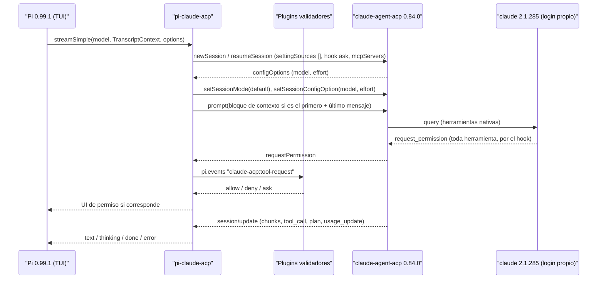

# Spec: pi-claude-acp

Estado: diseño cerrado y confirmado por entrevista (2026-09-29/30). Entrega única con capas internas (ver §9).

## 1. Objetivo

Extensión de Pi que conecta Pi con el agente de Anthropic a través de ACP, igual que Zed. Lanza `@agentclientprotocol/claude-agent-acp@0.84.0`, que lanza el binario `claude` del sistema con su propio login.

Pi engloba al agente y maneja el resto. Claude Code solo recibe el prompt, trabaja y devuelve el resultado a Pi. Guardrails, modos, skills y validaciones se definen en Pi; las validaciones viven en otros plugins. La configuración de `~/.claude` queda reservada para la app de Claude Code y no se carga desde Pi.



## 2. Módulos

```
src/
├── connection.ts   # lanza el adaptador, JSON-RPC por stdio, valida el binario   ← cambia si cambia el SDK de ACP
├── sessions.ts     # sesión Pi ↔ sesión ACP, opciones de sesión, bloque de contexto ← cambia si cambia la semántica de sesiones de Pi
├── catalog.ts      # configOptions model/effort → Model de Pi                   ← cambia si cambia el formato de modelos del adaptador
├── stream.ts       # session/update → AssistantMessageEvent                     ← cambia si cambia el contrato de stream de Pi o de ACP
├── permissions.ts  # request_permission → puente pi.events + UI de Pi           ← cambia si cambia el contrato de validación
├── login.ts        # claude auth status/login → aviso y comando /claude-login    ← cambia si cambia la CLI de autenticación de Claude Code
└── index.ts        # registerProvider y handlers de eventos; sin lógica propia
```

Contratos (ajustados a las APIs instaladas; ver §8):

```ts
// connection.ts
function openConnection(env: { CLAUDE_CODE_EXECUTABLE?: string }): Promise<AcpConnection>;
// sessions.ts
function ensureSession(conn: AcpConnection, piSessionId: string, cwd: string): Promise<AcpSession>;
// catalog.ts
function toPiModels(options: SessionConfigOption[]): ProviderModelConfig[];
function toEffort(level: ThinkingLevel | undefined, offered: string[]): string | undefined;
// stream.ts
function mapUpdate(update: SessionUpdate, message: AssistantMessage): AssistantMessageEvent | undefined;
// permissions.ts
function decide(request: RequestPermissionRequest, ctx: DecideContext): Promise<RequestPermissionResponse>;
```

## 3. Invariantes

- La request a Anthropic la emite solo el binario de Claude Code. La extensión no agrega headers, no inyecta ni reenvía el system prompt de Pi, y no lee, guarda ni registra tokens o credenciales.
- En cada turno, a ACP va solo el último mensaje del usuario. Excepción acordada: el primer prompt de cada sesión ACP lleva antes el bloque de contexto de Pi (§5.3), como texto de usuario.
- Los `tool_call` de ACP se muestran como texto, nunca como eventos `toolcall_*` de Pi.
- Modelos y niveles de effort se leen en runtime de `configOptions`. No hay lista fija de identificadores de modelo.
- `@agentclientprotocol/claude-agent-acp` fijado exacto en `0.84.0`. `CLAUDE_CODE_EXECUTABLE` apunta al binario `claude` del sistema; nunca al embebido.
- Claude Code no carga nada de `~/.claude`: `settingSources: []`, sin plugins de Claude Code.
- Una aprobación sale de la UI de Pi, de los plugins validadores o del Modo que eligió el usuario (README, "Modes"). El Modo solo aprueba lo que llegaría al diálogo: un `deny` de un validador siempre gana. `ToolSearch` se aprueba en todo Modo porque solo carga herramientas diferidas. En Auto, el clasificador de Claude Code aprueba lo que no escala.
- Ningún secreto va en una línea de comandos: el Agent SDK pasa los servidores MCP en `--mcp-config`, visible en `/proc/<pid>/cmdline`. Los valores de headers y env viajan en el entorno del proceso de Claude Code como `${PI_MCP_<n>}` (`mcp-config.ts`).
- El texto que escriben las herramientas, los subagentes, el modelo o un servidor MCP se muestra sin secuencias de escape de terminal (`terminal-text.ts`).
- El log (`~/.pi/agent/claude-acp/adapter.log`) tiene modo `0600`, nombra cada herramienta sin su comando y rota a `adapter.log.1` al pasar 1 MiB.
- La extensión no escribe en stdout ni stderr del proceso de Pi.
- Cada cambio probable toca un solo módulo. `index.ts` solo registra y une.

## 4. Proyecto y toolchain

| Decisión | Valor |
| --- | --- |
| Ubicación | Raíz del repo, junto a `ai_docs/` |
| Paquetes | `bun install` |
| Tests | vitest, contra una conexión ACP falsa en memoria |
| Typecheck | `tsc --noEmit` con `strict: true` |
| Lint/format | Biome |
| Git hooks | `.githooks/` + `"prepare": "git config core.hooksPath .githooks"`. `pre-commit`: tsc + `biome check`. `pre-push`: tsc + `vitest run`. El smoke test nunca corre en hooks |
| Pi | `@earendil-works/pi-coding-agent` 0.99.1 como devDependency (tipos); instalado por el usuario en `~/.pi/agent/bin/pi` |
| Provider id | `claude-acp` |
| Idioma de textos visibles | Español |
| Tareas | `TASKS.md` |

## 5. Comportamiento por módulo

### 5.1 connection.ts

- Un solo proceso del adaptador por proceso de Pi, lanzado al primer uso y compartido por todas las sesiones.
- Lanzamiento: `node <pkg>/dist/index.js` (`claude-agent-acp/dist/index.js:1`).
- Resolución del binario:
  1. `CLAUDE_CODE_EXECUTABLE` si está definida; si no, `claude` resuelto en el PATH.
  2. Validación antes de lanzar: existe, es ejecutable y `<exe> --version` devuelve como primera línea `^\d+\.\d+\.\d+ \(Claude Code\)$`.
  3. Si falla: error con la ruta probada y la salida obtenida. El wrapper de mise (`~/.local/bin/claude`) falla esta validación porque escribe en stdout.
  4. La versión leída se guarda para el error del caso 15.
- Valor del usuario: `CLAUDE_CODE_EXECUTABLE=~/.local/share/mise/installs/claude/latest/claude`. El symlink `latest` sigue las actualizaciones de mise.
- Sin fallback al binario embebido.
- stderr del adaptador: buffer acotado en memoria + archivo de log en `getAgentDir()/claude-acp/adapter.log`.

### 5.2 catalog.ts

- Fuente: config option id `"model"` (category `"model"`) y config option id `"effort"` (category `"thought_level"`) de `NewSessionResponse.configOptions`.
- La lista de modelos la produce el binario de Claude Code (`initializationResult.models`, `acp-agent.js:6819`). Actualizar Claude Code actualiza el catálogo en la próxima sesión nueva.
- Carga inicial: la factory de la extensión es async y espera la sesión de arranque, con timeout de 15 s. La sesión de arranque usa `_meta.claudeCode.options.persistSession: false` y se cierra con `closeSession`. Si falla: catálogo vacío, `ctx.ui.notify` con el error y reintento en el próximo uso.
- Recarga: cada `newSession` compara la lista y vuelve a llamar a `pi.registerProvider` si cambió. `refreshModels` fuerza la recarga.
- Campos sin dato en ACP: `contextWindow` arranca en 128000 (default documentado de Pi) y se reemplaza por `usage_update.size` tras el primer turno. `maxTokens` = 16384. `cost` en 0. `promptCache` sin definir.
- `reasoning: true` solo si el modelo ofrece `effort`. `thinkingLevelMap` oculta los niveles no ofrecidos.
- Mapeo de thinking: nivel ofrecido más cercano por debajo; `off` y `minimal` van al nivel más bajo ofrecido. El valor `"default"` no se usa.

### 5.3 sessions.ts

- Opciones de cada `newSession`/`resumeSession`, vía `_meta.claudeCode.options`:
  - `settingSources: []`.
  - `settings` inline con el hook `PreToolUse`, matcher `*`, tipo command, que devuelve `{"hookSpecificOutput":{"hookEventName":"PreToolUse","permissionDecision":"ask"}}`.
- `mcpServers` del request ACP: leídos de `~/.pi/agent/mcp.json`, más el servidor del harness en una sesión de Pi. Sus valores de headers y env pasan a `_meta.claudeCode.options.env` (§3).
- `cwd`: ruta absoluta del cwd de Pi al crear la sesión.
- Después de crear o reanudar: `setSessionMode(<Modo de la sesión de Pi>)`, porque el adaptador lee `defaultMode` de `~/.claude` aunque `settingSources` sea `[]` (`claude-agent-acp/dist/settings.js:79-88`). Una sesión nueva empieza en Manual (`default`); las sesiones descartables, siempre en `default`.
- Bloque de contexto de Pi: `~/.pi/agent/AGENTS.md`, `AGENTS.md` del proyecto y lista de skills de Pi (nombre, descripción, ruta de `SKILL.md`). Va antes del primer prompt de cada sesión ACP y se reenvía tras una sesión nueva, un reinicio (casos 6 y 7) o un `compaction_update` de Claude Code.
- Persistencia: `pi.appendEntry("claude-acp-session", {acpSessionId, leafId})` después de cada turno; se lee en `session_start` con `ctx.sessionManager.getEntries()`.
- Reanudación: `resumeSession` (no reproduce historial). Si falla, sesión nueva y un aviso con `ui.notify`, fuera del transcript (CONTEXT.md, "Aviso").
- Divergencia: si el `leafId` guardado no está en `ctx.sessionManager.getBranch()`, sesión nueva y aviso con `ui.notify`. Un fork de Pi crea otro id de sesión sin registro, lo que abre una sesión nueva. No se usa `unstable_forkSession`.
- Serialización: una cola por sesión; el segundo prompt espera al primero.
- Llamadas internas: `options.sessionId !== ctx.sessionManager.getSessionId()` identifica compaction y resúmenes (`pi-coding-agent/dist/core/sdk.js:257`). Van a una sesión ACP descartable.
- Compactación de Pi: `session_before_compact` devuelve `{cancel: true}` cuando el modelo activo es `claude-acp`. Cuando exista el plugin de self-compact, él toma ese evento y este handler se quita.
- `ctx` se vuelve a capturar en cada `session_start` y se limpia en `session_shutdown`. En todo `session_shutdown`, la instancia cierra sus sesiones ACP, su turno vivo y su servidor del harness; el adaptador compartido solo se cierra con `quit` o `reload`.

### 5.4 stream.ts

| Update ACP | Salida en Pi |
| --- | --- |
| `agent_message_chunk` | `text_*` |
| `agent_thought_chunk` | `thinking_*` |
| `tool_call` | Línea de texto al iniciar: `▸ <título>` |
| `tool_call_update` con estado final | Línea `✓ completed` / `✗ failed` + resultado truncado a 5 líneas o 400 caracteres, con `… (+N líneas)` |
| `tool_call_update` intermedio | Ignorado |
| `plan` | Checklist en texto cada vez que cambia |
| `available_commands_update`, `current_mode_update`, otros | Ignorado, registrado en el log |
| Tipo desconocido | `undefined`, registrado en el log, no corta el stream |

- Fin: `end_turn` → `done` (`stop`). `cancelled` → `error` con `aborted`. `max_tokens`, `max_turn_requests`, `refusal` → `error` con el motivo.
- Usage: tokens desde `PromptResponse.usage` (por turno en el adaptador, `acp-agent.js:2393`). `cost.total` = delta de `usage_update.cost.amount` (acumulado) entre turnos. Campos ausentes en 0.
- Updates de otra sesión o posteriores al fin del turno: descartados por `sessionId` y estado del turno.
- Imágenes: se envían; el adaptador anuncia `promptCapabilities.image: true` (`acp-agent.js:1139-1310`). Si una versión futura no lo anuncia: error explícito.
- Abort: `cancel`, permisos pendientes respondidos `cancelled`, stream termina `aborted`.

### 5.5 permissions.ts

- Toda herramienta de Claude Code llega acá, por el hook de §5.3.
- Puente: emite `claude-acp:tool-request` en `pi.events` con `{toolCall, options, vote(promise)}`. Espera los votos.
  - Cualquier `deny` → rechazo, también para `ExitPlanMode`.
  - Algún `ask`, o sin validadores → UI de Pi con herramienta, comando o ruta, y opciones.
  - Todos `allow` → aprobación.
- Opciones `allow_always` (optionId `allow-with-updates`) filtradas: con el hook `"ask"` la regla escrita se ignora y la opción engaña.
- Sin UI (`ctx.hasUI === false`) y sin decisión de validadores → rechazo.
- Request durante una cancelación → `cancelled`, también en el diálogo del plan.
- `ExitPlanMode`: los validadores votan, pero un `allow` no lo aprueba; sin `deny`, decide el usuario en el diálogo del plan.
- El título del diálogo muestra el comando o la ruta; sin ninguno, la entrada completa de la herramienta, un campo por línea y sin cortes.

## 6. Casos límite

Los 25 casos de la especificación original se mantienen, con estos ajustes:

| Caso | Ajuste |
| --- | --- |
| 3 | Sin login, `prompt` falla con `-32000 Authentication required` (`acp-agent.js:2784-2788`); `newSession` no lo detecta. `session_start` consulta `claude auth status --json` y avisa; el error del turno indica `/claude-login`, que corre `claude auth login` en la terminal de Pi y reinicia el adaptador |
| 6 | Mecanismo: `pi.appendEntry` + `resumeSession` |
| 10 | Distinguible por `options.sessionId`; sesión descartable + cancelación de compactación |
| 11 | Factory async bloqueante, timeout 15 s, `persistSession: false` |
| 13 | Pi 0.99.1 incluye `max` en `ThinkingLevel` |
| 16 | Placeholders 128000 / 16384 / cost 0 |
| 23 | Política vía puente `pi.events` + UI; filtro de `allow_always` |

Casos nuevos, cada uno con test:

- **C26** — `sessions.ts`: toda sesión se crea con `settingSources: []` y el hook `"ask"`.
- **C27** — `sessions.ts`: tras crear o reanudar se llama `setSessionMode` con el Modo de la sesión de Pi.
- **C28** — `sessions.ts`: el bloque de contexto va solo en el primer prompt y se reenvía tras reinicio o `compaction_update`.
- **C29** — `sessions.ts`: `session_before_compact` se cancela con modelo `claude-acp` y no con otros.
- **C30** — `permissions.ts`: combinaciones de votos (deny gana; ask → UI; all allow → aprobación; sin votos → UI; sin UI → rechazo).
- **C31** — `permissions.ts`: las opciones `allow_always` no llegan a la UI.
- **C32** — `catalog.ts`: un cambio en la lista de modelos de una sesión nueva vuelve a registrar el provider.
- **C33** — `connection.ts`: un ejecutable cuyo `--version` no coincide (wrapper) se rechaza con ruta y salida.
- **C34** — `login.ts`: con un modelo `claude-acp` y `loggedIn: false`, `session_start` avisa con `/claude-login`; con otro provider no consulta el binario.
- **C35** — `login.ts`: `/claude-login` detiene la TUI, corre `claude auth login` con la terminal de Pi y reanuda la TUI.
- **C36** — `login.ts`: tras un login confirmado por `auth status`, el adaptador se reinicia; sin login confirmado, no.
- **C37** — `login.ts`: fuera de la TUI, `/claude-login` no corre nada e indica `claude auth login` en una terminal.
- **C38** — `sessions.ts`: un prompt que empieza con `/` va sin el bloque de contexto; el bloque queda pendiente para el próximo prompt.
- **C39** — `usage.ts`, `stream.ts`: `totalTokens` es el último `usage_update.used`, no la suma de los requests del turno; en un mensaje de varios turnos ACP gana el contexto del último.
- **C40** — `compact.ts`: `/claude-compact` espera el fin del turno y envía `/compact` con las instrucciones; con otro provider no envía nada.
- **C41** — `harness.ts`: las herramientas de Pi que coinciden con `claudeAcp.hiddenTools` de `settings.json` (`*` = cualquier texto) no llegan al agente; sin la clave, o con un valor que no es una lista de nombres, no se oculta nada.

## 7. Verificación

- `tsc --noEmit` sin errores.
- `vitest run`: 33 casos contra una conexión ACP falsa en memoria.
- Carga en Pi: `pi -e ./src/index.ts`, con las sesiones de Pi redirigidas al scratchpad (`PI_CODING_AGENT_SESSION_DIR`) para no escribir en `~/.pi`.
- Smoke test real (una corrida, consume cuota):
  1. Abre una sesión real y lista los modelos.
  2. Envía `Respond with exactly: OK` con el modelo por defecto y el effort más bajo ofrecido; recibe texto.
  3. Pide un `Read` dentro del cwd y verifica que llega `request_permission`; lo responde con rechazo. Si no llega, falla con un mensaje que nombra el hook de §5.3.

## 8. Hallazgos del diseño original contra las APIs instaladas

| Diseño original | API real | Evidencia |
| --- | --- | --- |
| `@mariozechner/pi-*` | Deprecado en 0.73.1; vigente `@earendil-works/pi-*` 0.99.1 | npm registry |
| `ai_docs/` como referencia | Snapshot de 0.85.1 | `ai_docs/README.md:7` |
| `streamSimple(model, Context, …)` | `TranscriptContext` | `pi-coding-agent/dist/core/extensions/types.d.ts:1383` |
| `models.availableModels`, `SessionModelState` | No existen en SDK ACP 1.5.1; el modelo es el config option `"model"` | `@agentclientprotocol/sdk/dist/schema/types.gen.d.ts:2524-2540` |
| `set_config_option(model)` / `setSessionModel` | `setSessionConfigOption({configId:"model"})`; no hay `setSessionModel` | `@agentclientprotocol/sdk/dist/acp.d.ts:1128` |
| `session/resume` | `resumeSession` (estable) | `acp.d.ts:1096` |
| Embebido 2.1.156 sin `claude-opus-5-5` | Embebido 2.1.284 | `@anthropic-ai/claude-agent-sdk@0.3.284/package.json:91` |
| `acp-agent.js:627` | Correcto: `claudeCliPath()` lee `CLAUDE_CODE_EXECUTABLE` | `claude-agent-acp/dist/acp-agent.js:627-628` |
| `decide()` síncrono | Tiene que ser async (UI y votos) | `pi-coding-agent/dist/core/extensions/types.d.ts:80` |
| Model sin ventana ni precios | `contextWindow`/`maxTokens` obligatorios > 0; sin valor "desconocido" | `pi-coding-agent/dist/core/provider-composer.js:79-83` |
| Provider sin auth | Pi exige un método de auth; se usa la constante no secreta `"claude-code-login"` | `provider-composer.js:358` |
| Usage acumulado o incremental | `PromptResponse.usage` por turno en el adaptador; `usage_update.used` = contexto actual; `cost.amount` acumulado | `acp-agent.js:2393`, `3960-3966` |

No confirmado en runtime (evidencia solo por grep del binario 2.1.285):

- Que el hook `"ask"` de la capa inline se ejecute con `settingSources: []`. Se verifica en el smoke test.
- Que `bypassPermissions` nunca convierta un `"ask"` en allow. Mitigación: el Modo Bypass no se ofrece. En Auto, el hook se aparta a propósito y decide el clasificador.

## 9. Alcance y entrega

- Una sola entrega, con capas internas en este orden: conexión → catálogo → sesiones → stream → permisos → puente, bloque de contexto y MCP. Confirmado.
- Fuera de alcance:
  - Plugin validador en TS que reemplaza `guard-bash.sh` y las 15 reglas `Read(...)` deny de `~/.claude/settings.json`, con config en `~/.pi/agent/`. Se diseña en otra sesión contra el contrato de §5.5.
  - Plugin de self-compact. Toma `session_before_compact` cuando exista.
- `pi-shell-acp` sigue instalado para otros providers. Alerta: con Claude corre sin `guard-bash.sh` ni las reglas deny (`pi-shell-acp/acp-bridge.ts:1150`, `index.ts:132`).
